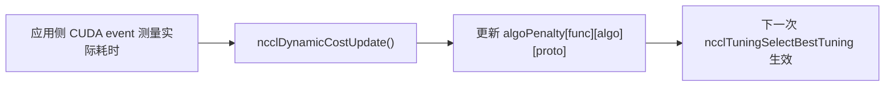

# NCCL 动态代价表 / 评分表改造设计文档

> 本文档对应本次对 NCCL 2.31.2 源码的改动：在 host 侧 tuning 层加入一套
> “动态评分表”，让算法选择除了依赖静态代价模型，还能根据运行时反馈自动/手动
> 调整不同算法组合的评分。
>
> 改动文件：
> - `src/include/tuning.h`
> - `src/tuning/tuning_general.cc`
> - `src/tuning/tuning.cc`

## 1. 需求分析

### 1.1 背景

NCCL 的 host 侧在每次集合操作时，会经过如下流程选择算法和协议：

```text
ncclAllGather / ncclAllReduce / ...
  -> taskAppend / ncclEnqueueCheck
  -> ncclGroupEndInternal -> groupLaunch
  -> ncclPrepareTasks
  -> ncclGetAlgoInfo
  -> ncclTuningCompute   （旧版本的 topoGetAlgoInfo）
  -> 选择 timeUs 最小的 (algo, proto)
```

其中 `ncclTuningCompute` 使用的代价模型是“静态”的：它只依赖拓扑带宽、消息规模、
算法/协议的基础延迟和带宽常量。它不知道当前机器上的瞬时负载、网络拥塞、功耗降频、
NUMA 抖动等动态因素。

因此可能出现：

- 模型预估某个组合很便宜；
- 实际运行时该组合明显偏慢；
- NCCL 仍然每次都选它，因为静态代价表不会改变。

### 1.2 目标

1. 为每个 `(func, algo, proto)` 组合维护一个可动态调整的评分；
2. 算法选择时，把该评分作用到预估时间上；
3. 支持“实际耗时明显高于预估时，降低该组合的评分”，从而让 NCCL 在下一次选择时
   自然避开表现差的组合；
4. 支持手动更新和重置，方便调试与实验；
5. 保持对原有路径的影响最小：默认评分恒为 1.0 时，行为与未修改版本完全一致。

### 1.3 非目标

本改动不包含：

- 在 NCCL 核心内部自动埋点测量每个 collective 的 GPU 实际耗时；
- 自动记录“本次选择了哪个 (algo, proto)”并反馈；
- 跨 rank 自动同步评分表；
- 修改公开 `nccl.h` API。

这些属于后续扩展，原因见第 9 节。

### 1.4 约束与假设

- **算法选择必须跨 rank 一致**：同一个 communicator 的所有 rank 必须对同一次
  collective 选出完全相同的 `(algo, proto)`，否则会发生死锁或数据错误。因此评分表
  的更新必须在所有 rank 上保持一致，不能各自按本机测量结果独立更新。
- 评分表属于 `ncclComm`，生命周期与 communicator 一致。
- 默认不引入额外同步和锁；评分更新建议由单一控制线程完成，或由应用侧保证
  所有 rank 收到相同的更新参数。

## 2. 总体设计

### 2.1 核心思想

把“评分”建模成一个乘法惩罚系数 `penalty`：

```text
effectiveTime = staticTimeUs * penalty
```

- `penalty = 1.0`：不惩罚，等价于原始静态模型；
- `penalty > 1.0`：该组合被放大，看起来更贵，更难被选中；
- `penalty` 通过“实际耗时 / 预估耗时”的比值持续更新。

### 2.2 更新公式

定义：

```text
ratio = measuredUs / estimatedUs
```

更新使用指数移动平均（EMA），避免单次测量噪声：

```text
if ratio > threshold:
    target = cur * (1 + alpha * (ratio - 1))
    score  = min(target, maxPenalty)
else:
    target = cur - alpha * (cur - 1)
    score  = max(target, 1.0)
```

当前默认参数：

| 参数 | 值 | 含义 |
| --- | --- | --- |
| `threshold` | 1.2 | 实际比预估慢超过 20% 才扣分 |
| `alpha` | 0.2 | EMA 步长，越小越平滑 |
| `maxPenalty` | 8.0 | 惩罚上限，防止组合被永久锁死 |

### 2.3 与原有 tuning 框架的关系

改动只接在“选择最优 tuning”这一环，不修改各算法的 `Init/Sim` 模型本身：

```text
静态模型 Sim()  -> timeUs
                      |
                      v
              ncclTuningSelectBestTuning()
                      |
        +------------ v ------------+
        | effectiveTime = timeUs * penalty |
        +----------------------------+
                      |
                      v
              选 effectiveTime 最小者
```

## 3. 数据结构

### 3.1 新增字段：`algoPenalty`

`src/include/tuning.h` 中，`ncclTuningContext_t` 新增：

```c
struct ncclTuningContext_t {
  ncclTunerConstants_t tuningConstants;
  int forced[NCCL_NUM_FUNCTIONS];
  int enabled[NCCL_TUNING_COUNT][NCCL_NUM_FUNCTIONS];

  float generalLatencies[NCCL_NUM_FUNCTIONS]
                        [NCCL_NUM_ALGORITHMS]
                        [NCCL_NUM_PROTOCOLS];
  float generalBandwidths[NCCL_NUM_FUNCTIONS]
                         [NCCL_NUM_ALGORITHMS]
                         [NCCL_NUM_PROTOCOLS];

  // 动态评分表：默认 1.0；大于 1.0 表示该组合被扣分。
  float algoPenalty[NCCL_NUM_FUNCTIONS]
                   [NCCL_NUM_ALGORITHMS]
                   [NCCL_NUM_PROTOCOLS];

  ssize_t threadThresholds[NCCL_NUM_ALGORITHMS][NCCL_NUM_PROTOCOLS];
  int maxThreads[NCCL_NUM_ALGORITHMS][NCCL_NUM_PROTOCOLS];
};
```

维度与取值范围：

- `NCCL_NUM_FUNCTIONS = 5`：Broadcast / Reduce / AllGather / ReduceScatter / AllReduce；
- `NCCL_NUM_ALGORITHMS = 7`：Tree / Ring / CollNetDirect / CollNetChain / NVLS /
  NVLS_Tree / PAT；
- `NCCL_NUM_PROTOCOLS = 3`：LL / LL128 / Simple。

所以评分表大小为 `5 × 7 × 3` 个 `float`。

### 3.2 复用的既有结构

本改动没有引入新的主数据结构，而是复用 tuning 框架已有的两个结构：

- `ncclTuningInput_t`：一次算法选择请求的输入，含 `comm`、`func`、`datatype`、
  `nBytes`、`collNetSupport`、`nvlsSupport` 等；
- `ncclTuningResult_t`：一个候选组合的模拟结果，含 `algo`、`proto`、`timeUs`、
  `symKernelId`、`ceMethodId`、`nChannels` 等。

### 3.3 相关枚举

`func` 枚举在 `src/include/nccl_common.h`：

```c
#define NCCL_NUM_FUNCTIONS 5 // Send/Recv not included for now
typedef enum {
  ncclFuncBroadcast = 0,
  ncclFuncReduce = 1,
  ncclFuncAllGather = 2,
  ncclFuncReduceScatter = 3,
  ncclFuncAllReduce = 4,
  ...
} ncclFunc_t;
```

`algo` / `proto` 枚举在 `src/include/plugin/nccl_tuner.h`：

```c
#define NCCL_ALGO_TREE           0
#define NCCL_ALGO_RING           1
#define NCCL_ALGO_COLLNET_DIRECT 2
#define NCCL_ALGO_COLLNET_CHAIN  3
#define NCCL_ALGO_NVLS           4
#define NCCL_ALGO_NVLS_TREE      5
#define NCCL_ALGO_PAT            6

#define NCCL_PROTO_LL    0
#define NCCL_PROTO_LL128 1
#define NCCL_PROTO_SIMPLE 2
```

### 3.4 初始化与内存

`ncclTuningContext_t` 是 `ncclComm` 的成员，随 communicator 一起分配和释放，不需要
额外分配内存。初始化在 `ncclTuningInit()` 中完成，把整张表置为 1.0。

## 4. 函数与流程

### 4.1 初始化：`ncclTuningInit`

`src/tuning/tuning.cc` 中，communicator 初始化 tuning 子系统时，先重置评分表：

```c
ncclResult_t ncclTuningInit(struct ncclComm* comm) {
  ncclResult_t ret = ncclSuccess;

  // 初始化动态评分表：默认所有 (func, algo, proto) 组合评分为 1.0。
  for (int f = 0; f < NCCL_NUM_FUNCTIONS; f++)
    for (int a = 0; a < NCCL_NUM_ALGORITHMS; a++)
      for (int p = 0; p < NCCL_NUM_PROTOCOLS; p++)
        comm->tuningContext.algoPenalty[f][a][p] = 1.0f;

  NCCLCHECKGOTO(ncclTunerPluginLoad(comm), ret, fail);
  ...
}
```

### 4.2 选择算法：`ncclTuningSelectBestTuning`

`ncclTuningCompute` 生成所有候选后，交给 `ncclTuningSelectBestTuning` 选最小代价。
本次改动把惩罚系数乘进去：

```c
static ncclResult_t ncclTuningSelectBestTuning(struct ncclTuningInput_t* const input,
                                               struct ncclTuningResultList_t* tunings,
                                               struct ncclTuningResult_t* const bestTuning) {
  bestTuning->timeUs = FLT_MAX;
  while (node != nullptr) {
    const struct ncclTuningResult_t& tuning = node->result;
    float effectiveTime = tuning.timeUs;

    // 只有普通算法组合（algo/proto 都有效）才参与动态评分。
    if (tuning.algo != NCCL_ALGO_UNDEF && tuning.proto != NCCL_PROTO_UNDEF) {
      effectiveTime *= ncclDynamicCostGetPenalty(input->comm, input->func,
                                                 tuning.algo, tuning.proto);
    }

    if (effectiveTime < bestTuning->timeUs) {
      *bestTuning = tuning;
      bestTuning->timeUs = effectiveTime; // 返回的预估时间也反映当前评分
    }
    node = node->next;
  }
  return ncclSuccess;
}
```

注意：symmetric kernel 和 CE 方法这两类候选的 `algo/proto` 是 `UNDEF`，不会被惩罚，
从而避免误伤。

### 4.3 查询惩罚：`ncclDynamicCostGetPenalty`

`src/tuning/tuning_general.cc`：

```c
float ncclDynamicCostGetPenalty(struct ncclComm* comm, ncclFunc_t func,
                                int algo, int proto) {
  if (comm == nullptr || func < 0 || func >= NCCL_NUM_FUNCTIONS ||
      algo < 0 || algo >= NCCL_NUM_ALGORITHMS ||
      proto < 0 || proto >= NCCL_NUM_PROTOCOLS) {
    return 1.0f; // 越界 / 未初始化一律回退到不扣分
  }
  float penalty = comm->tuningContext.algoPenalty[func][algo][proto];
  return penalty > 0.0f ? penalty : 1.0f;
}
```

### 4.4 更新评分：`ncclDynamicCostUpdate`

```c
ncclResult_t ncclDynamicCostUpdate(struct ncclComm* comm, ncclFunc_t func,
                                   int algo, int proto,
                                   float measuredUs, float estimatedUs) {
  // 参数校验 ...
  float ratio = measuredUs / estimatedUs;

  const float kPenaltyThreshold = 1.2f;
  const float kUpdateAlpha = 0.2f;
  const float kMaxPenalty = 8.0f;

  float* slot = &comm->tuningContext.algoPenalty[func][algo][proto];
  float cur = (*slot > 0.0f) ? *slot : 1.0f;

  if (ratio > kPenaltyThreshold) {
    float target = cur * (1.0f + kUpdateAlpha * (ratio - 1.0f));
    *slot = target < kMaxPenalty ? target : kMaxPenalty;
  } else {
    float target = cur - kUpdateAlpha * (cur - 1.0f);
    *slot = target < 1.0f ? 1.0f : target;
  }
  return ncclSuccess;
}
```

### 4.5 重置评分：`ncclDynamicCostReset`

```c
ncclResult_t ncclDynamicCostReset(struct ncclComm* comm) {
  if (comm == nullptr) return ncclInvalidArgument;
  for (int f = 0; f < NCCL_NUM_FUNCTIONS; f++)
    for (int a = 0; a < NCCL_NUM_ALGORITHMS; a++)
      for (int p = 0; p < NCCL_NUM_PROTOCOLS; p++)
        comm->tuningContext.algoPenalty[f][a][p] = 1.0f;
  return ncclSuccess;
}
```

### 4.6 完整调用链

```mermaid
flowchart LR
  A["collective API"] --> B["ncclEnqueueCheck"] --> C["taskAppend"]
  C --> D["ncclGroupEndInternal"] --> E["groupLaunch"]
  E --> F["ncclPrepareTasks"] --> G["ncclGetAlgoInfo"]
  G --> H["ncclTuningCompute"]
  H --> I["ncclTuningComputeAllTunings"]
  I --> J["各模型 Sim() 得到 timeUs"]
  J --> K["ncclTuningSelectBestTuning()"]
  K --> L["effectiveTime = timeUs * penalty"]
  L --> M["选最小 effectiveTime"]
```



### 4.7 反馈链



## 5. 关键代码清单

| 位置 | 内容 |
| --- | --- |
| `src/include/tuning.h:94` | 新增 `algoPenalty` 字段 |
| `src/include/tuning.h:106-113` | 新增三个接口声明 |
| `src/tuning/tuning.cc:44-51` | 初始化评分表为 1.0 |
| `src/tuning/tuning.cc:158-183` | 选择器乘惩罚系数 |
| `src/tuning/tuning.cc:210` | `ncclTuningSelectBestTuning` 调用点改为传入 `input` |
| `src/tuning/tuning_general.cc:83-145` | `GetPenalty` / `Reset` / `Update` 实现 |

## 6. 使用方式

### 6.1 测量实际耗时

NCCL collective 是异步的，需要用 CUDA event 在同一个 stream 上测量：

```cuda
cudaEvent_t start, stop;
cudaEventCreate(&start);
cudaEventCreate(&stop);

cudaEventRecord(start, stream);
ncclAllReduce(sendbuff, recvbuff, count, ncclFloat, ncclSum, comm, stream);
cudaEventRecord(stop, stream);

cudaEventSynchronize(stop);
float ms = 0.f;
cudaEventElapsedTime(&ms, start, stop);
float actualUs = ms * 1000.0f;   // 毫秒 -> 微秒
```

### 6.2 获取预估耗时

预估时间由 `ncclTuningCompute` 给出，可以通过 group 模拟接口拿到：

```c
ncclGroupStart();
ncclAllReduce(sendbuff, recvbuff, count, ncclFloat, ncclSum, comm, stream);
ncclSimInfo_t sim = NCCL_SIM_INFO_INITIALIZER;
ncclGroupSimulateEnd(&sim);   // sim.estimatedTime 为预估微秒
ncclGroupEnd();
```

### 6.3 手动反馈

已知本次组合时，直接调用内部接口：

```c
// 例如手动惩罚 AllReduce 的 Ring + Simple 组合
ncclDynamicCostUpdate(comm, ncclFuncAllReduce, NCCL_ALGO_RING, NCCL_PROTO_SIMPLE,
                      actualUs, estimatedUs);
```

### 6.4 半自动反馈

应用侧测量实际耗时后，由 rank 0 计算更新量并广播给所有 rank，保证所有 rank 的
评分表保持一致，然后各 rank 调用 `ncclDynamicCostUpdate`。

## 7. 测试

### 7.1 单元测试（函数级）

可针对 `src/tuning/tuning_general.cc` 的三个函数写小型单元测试：

1. `ncclDynamicCostGetPenalty` 在 `algoPenalty` 未初始化（全 0）时返回 1.0；
2. 非法参数（`func/algo/proto` 越界、`comm == nullptr`）返回错误或 1.0；
3. `ncclDynamicCostReset` 后整张表恒为 1.0；
4. `ncclDynamicCostUpdate`：
   - `measuredUs / estimatedUs <= 1.2` 时惩罚不增加；
   - 比值大于 1.2 时惩罚上升；
   - 连续多次正常反馈后惩罚缓慢回落到 1.0；
   - 多次异常反馈后惩罚不超过 8.0。

示例伪代码：

```c
// 构造一个最小 comm（或对独立函数做参数化测试）
ncclDynamicCostUpdate(comm, ncclFuncAllReduce, NCCL_ALGO_RING, NCCL_PROTO_SIMPLE, 200.0f, 100.0f);
float p = ncclDynamicCostGetPenalty(comm, ncclFuncAllReduce, NCCL_ALGO_RING, NCCL_PROTO_SIMPLE);
assert(p > 1.0f);
```

### 7.2 集成 / 功能测试

1. **默认等价性测试**：不调用任何更新接口时，跑 nccl-tests，确认行为与未修改版本
   一致（评分表全 1.0）。
2. **单组合惩罚测试**：先强制使用某个组合（通过 `NCCL_ALGO` / `NCCL_PROTO` 环境变量
   或 per-call `algSelection`），再手动惩罚它，观察日志中该组合的 `effective` 时间变大。
3. **多组合选择测试**：允许自动选择，先让某组合被惩罚，观察下一次选择是否切换到
   其他 `(algo, proto)`（需要保证该场景下确实存在替代组合）。
4. **重置测试**：调用 `ncclDynamicCostReset` 后，选择行为回到默认。

### 7.3 验证方法（日志）

开启 tuning 日志：

```bash
NCCL_DEBUG=INFO NCCL_DEBUG_SUBSYS=TUNING ./your_app
```

选择器现在会打印额外字段：

```text
A/P/S RING/SIMPLE/Count, time: 123.4, effective: 148.1
Best tuning { ..., timeUs = 148.1, .algo = RING, .proto = SIMPLE, ... }
```

其中 `effective` 越大，说明该组合被扣分越重。

### 7.4 测试脚本建议

可以写一个最小 CUDA 程序：

1. 初始化 communicator；
2. 用 CUDA event 测一次 AllReduce 实际耗时；
3. 用 `ncclGroupSimulateEnd` 拿预估耗时；
4. 调用 `ncclDynamicCostUpdate` 反馈；
5. 再跑一次并观察 `NCCL_DEBUG_SUBSYS=TUNING` 日志中的 `effective` 值。

## 8. 参数调优

三个常量目前写死在 `ncclDynamicCostUpdate` 中：

- `kPenaltyThreshold = 1.2f`：实际比预估慢 20% 以上才扣分。调大则更宽容，调小则更敏感。
- `kUpdateAlpha = 0.2f`：EMA 步长。越小越平滑、越难被单次异常值带偏。
- `kMaxPenalty = 8.0f`：惩罚上限。防止某个组合被永久锁死。

后续可改成 `NCCL_PARAM` 环境变量，便于线上调参。

## 9. 局限与后续工作

### 9.1 跨 rank 一致性

这是最重要的约束：同一 communicator 的所有 rank 必须选出相同的 `(algo, proto)`。
如果每个 rank 只根据本机测量独立更新评分表，最终可能选择不一致，导致死锁或错误。
因此反馈必须由应用侧保证一致，或在 NCCL 内部做跨 rank 同步。

### 9.2 应用侧不知道选中的组合

目前 `algo/proto` 没有暴露在公开 `nccl.h`，应用侧通常不知道 NCCL 这次选了哪个组合，
因此无法自动、精确地反馈。可选的后续方案：

- 在 `ncclGetAlgoInfo` 里把最后选中的 `(func, algo, proto, estimatedUs)` 记录到 `comm`；
- 增加查询接口或回调，供应用侧/监控线程读取；
- 增加 `nccl.h` 级薄封装，把 `ncclDynamicCostUpdate` 暴露成公开 API。

### 9.3 线程安全

当前未加锁。评分表更新建议由单一控制线程完成，或由应用侧串行化。如果要在多线程
环境中并发更新，需要为评分表加锁或使用原子更新。

### 9.4 自动测量

“每完成一次集合操作就自动测量并更新”需要在 NCCL 核心埋点（CUDA event 或 profiler），
会引入额外开销和复杂度。更实际的路径是复用现有 profiler 插件（`plugins/profiler`）
拿到真实 kernel/proxy 事件，再驱动本评分表更新。

## 10. 参考文件

- `src/include/tuning.h`：tuning 上下文与接口声明
- `src/tuning/tuning.cc`：初始化与最优选择
- `src/tuning/tuning_general.cc`：动态评分实现
- `src/include/nccl_common.h`：`ncclFunc_t` 枚举
- `src/include/plugin/nccl_tuner.h`：`algo` / `proto` 枚举
- `src/enqueue/enqueue.cc`：`ncclGetAlgoInfo` 调用点
