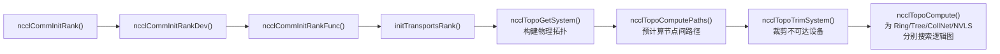
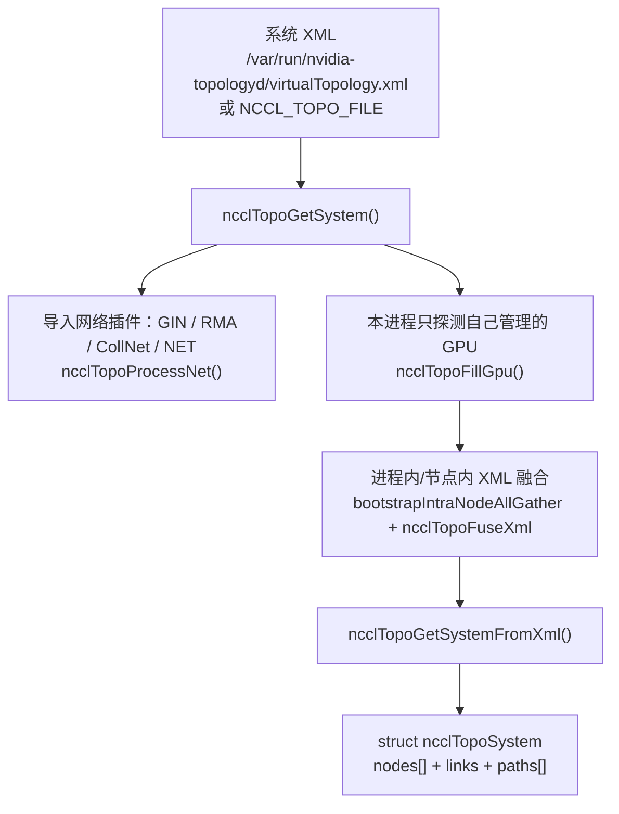
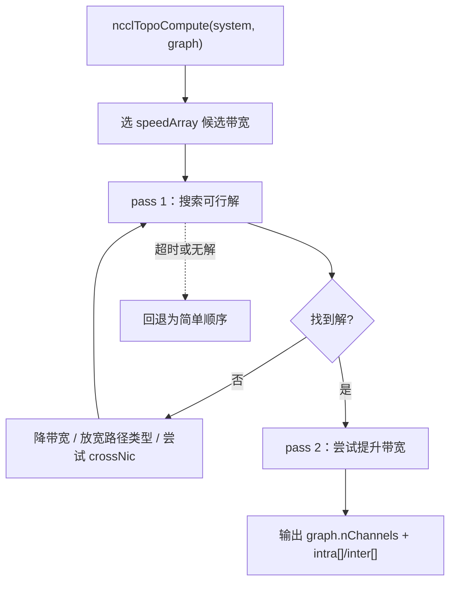
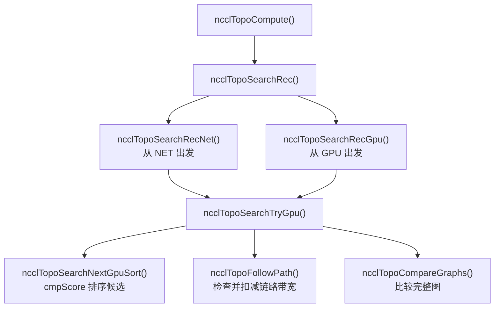
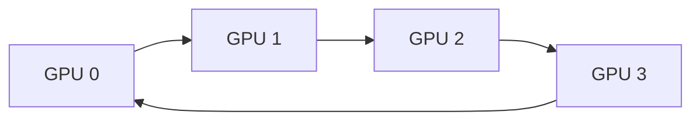
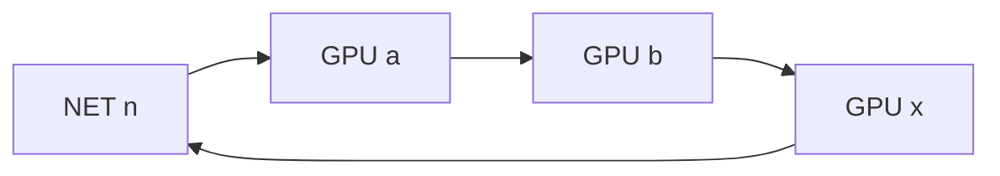
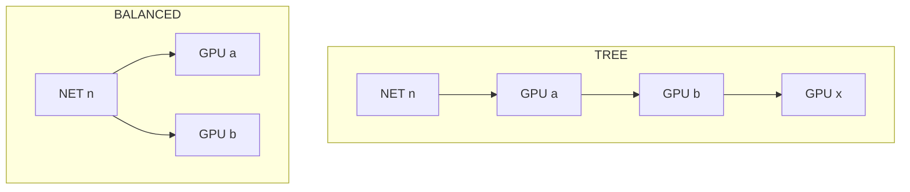

# NCCL host 侧核心①：拓扑建立与算法搜索

> 基于本仓库 NCCL 2.31.2 源码。  
> 主线文件：`src/init.cc`、`src/graph/topo.cc`、`src/graph/paths.cc`、`src/graph/search.cc`、`src/include/graph.h`。  
> 文中 Mermaid 图需要在支持 Mermaid 的渲染器（GitHub / GitLab / Typora / Obsidian / VSCode 插件）中查看。

## 为什么 host 侧“拓扑 + 搜索”是核心

NCCL 对外是一个 GPU 集合通信库，但它的难点不在“把数据从 A 搬到 B”，而在于：

> 给一次集合操作，在**当前的机器物理连接**上，选出**最合适的逻辑路径与执行方案**。

这里的“资源”是分层的：

- 物理资源：GPU、NVSwitch、PCIe、NUMA/CPU、NIC、网络；
- 逻辑资源：ring、tree、NVLS、CollNet 这些通信图；
- 执行资源：channel 数、transport 类型、协议、CTA 数、分块大小。

所以 host 侧真正重要的两步是：

1. **拓扑建立**：把机器上 GPU 之间、GPU 与 NIC 之间的真实连接变成一张图；
2. **算法搜索**：在这张图上，为 ring / tree / NVLS / CollNet 等算法，搜出“数据实际会走的路径”。

本文就围绕这两步展开。

## 0. 全局调用链

一次 `ncclCommInitRank` 最终会在 `initTransportsRank()` 里完成拓扑构建和图搜索：



对应 `src/init.cc` 里的实际调用顺序：

```c
// src/init.cc
// Topo detection / System graph creation
ncclTopoGetSystem(comm, &comm->topo);
// Compute paths between GPUs and NICs
ncclTopoComputePaths(comm->topo, comm);
// Remove inaccessible GPUs and unused NICs
ncclTopoTrimSystem(comm->topo, comm);
// Recompute paths after trimming
ncclTopoComputePaths(comm->topo, comm);
// Init search
ncclTopoSearchInit(comm->topo);
```

这一串做完，才轮到后面给 `ringGraph`、`treeGraph`、`collNetGraph`、`nvlsGraph` 逐个调用 `ncclTopoCompute()`。

## 1. 物理拓扑：`ncclTopoSystem`

物理拓扑的入口是 `ncclTopoGetSystem()`，位置在 `src/graph/topo.cc`。它回答的问题是：

> 这台机器上，GPU、PCIe、CPU/NUMA、NIC 之间到底是怎么连起来的？

构建过程可以概括为：



几个关键事实：

- NCCL 默认优先读系统的 `virtualTopology.xml`，也可以通过 `NCCL_TOPO_FILE` 覆盖。
- 每个 rank 一开始只知道“自己这张卡”的局部信息；NCCL 通过 bootstrap 把同一节点内各 rank 的 XML 融合起来，拼出完整拓扑。
- 网络设备不是凭空出现的，而是通过 net / gin / rma / collnet 插件导入，`ncclTopoProcessNet()` 把它们变成拓扑里的 NET 节点。

`ncclTopoSystem` 里的节点类型很多，不是只有 GPU：

```c
// src/graph/topo.h
#define GPU 0
#define PCI 1
#define NVS 2
#define CPU 3   // 实际表示 NUMA 域
#define NIC 4
#define NET 5
#define GIN 6
#define RMA 7
#define DEV 8
#define CXB 9  // C2C Cross-Bridge
```

每个节点有若干 `links`，每条 link 有类型和带宽。这个结构就是“物理拓扑”。

## 2. 路径预计算：`ncclTopoComputePaths`

有了物理图还不够。搜索 ring/tree 时，NCCL 需要快速知道：

> 从 GPU A 到 GPU B 走哪条路？是 NVLink 直连、经过 PCIe 桥，还是绕 CPU？

这一步在 `src/graph/paths.cc` 的 `ncclTopoComputePaths()` 里完成，核心是 `ncclTopoSetPaths()`。

值得注意：它不是 Dijkstra，而是**广度优先搜索（BFS）**，源码注释也写明了：

```c
// src/graph/paths.cc
// breadth-first search to set all paths to that node in the system
static ncclResult_t ncclTopoSetPaths(struct ncclTopoNode* baseNode,
                                     struct ncclTopoSystem* system)
```

路径优劣的比较顺序不是简单“谁带宽大”，而是三元组：

1. 路径类型更好（数值越小越“近”）；
2. 同类型下带宽更高；
3. 同类型同带宽下跳数更少。

源码里对应的判断：

```c
// Update if better path type, OR same type with higher bw,
// OR same type/bw with strictly fewer hops.
if (newType < remPath->type ||
    (newType == remPath->type && remPath->bw < bw) ||
    (newType == remPath->type && remPath->bw == bw &&
     remPath->count > (path->count + 1))) {
  ...
}
```

路径类型在 `src/include/graph.h` 里定义，从近到远大致是：

| 类型 | 含义 |
| --- | --- |
| `PATH_LOC` | 本节点 |
| `PATH_NVL` | NVLink 直连 |
| `PATH_NVB` | 经一个中间 GPU 的 NVLink |
| `PATH_C2C` | C2C 互连 |
| `PATH_PIX` | 单个 PCIe 桥 |
| `PATH_PXB` | 多个 PCIe 桥（不经过 Host Bridge） |
| `PATH_P2C` / `PATH_PXN` | GPU-NIC 的特殊路径 |
| `PATH_PHB` | 经过 PCIe Host Bridge（通常绕 CPU） |
| `PATH_SYS` | 跨 NUMA 的 SMP 互连（QPI/UPI） |
| `PATH_NET` | 经过网络 |
| `PATH_DIS` | 不可达 |

`ncclTopoComputePaths` 还会根据 P2P / GDR / PXN 等情况改写路径：例如不允许 GPU Direct P2P 时强制绕 CPU，允许 PXN 时把 NIC 流量通过 NVLink 连接的相邻 GPU 转发。

这一步做完，`ncclTopoSystem` 里每个节点就都带上了到其他 GPU / NIC 的预计算路径。这是后面算法搜索的“原料”。

## 3. 逻辑拓扑：`ncclTopoGraph`

物理拓扑是“机器长什么样”，逻辑拓扑是“数据要走哪条路”。

```c
// src/include/graph.h
struct ncclTopoGraph {
  int id;            // ring:0, tree:1, collnet:2, nvls:3, collnetDirect:4
  int pattern;       // 哪种逻辑拓扑
  int crossNic;
  int collNet;
  int minChannels;
  int maxChannels;
  // 输出
  int nChannels;
  float bwIntra;     // 节点内带宽
  float bwInter;     // 跨节点带宽
  int typeIntra;
  int typeInter;
  int sameChannels;
  int nHops;
  int intra[MAXCHANNELS * NCCL_TOPO_MAX_NODES]; // 每条 channel 的 GPU 顺序
  int64_t inter[MAXCHANNELS * 2];               // 每条 channel 用到的 NET
};
```

`pattern` 不是只有 ring 和 tree，本版本有：

```c
#define NCCL_TOPO_PATTERN_BALANCED_TREE 1
#define NCCL_TOPO_PATTERN_SPLIT_TREE    2
#define NCCL_TOPO_PATTERN_TREE          3
#define NCCL_TOPO_PATTERN_RING          4
#define NCCL_TOPO_PATTERN_NVLS          5
#define NCCL_TOPO_PATTERN_COLLNET_DIRECT 6
```

`intra[]` 存的是“第 c 条 channel 上 GPU 的排列顺序”，`inter[]` 存这条 channel 用到的网卡。这是搜索的直接产物。

## 4. 搜索入口：`ncclTopoCompute`

`ncclTopoCompute()` 是每一种算法搜索的入口，位置在 `src/graph/search.cc`。它的工作模式是：

1. 按计算能力（`ccMin`）选一组合适的候选带宽档位 `speedArray`；
2. 从高带宽开始，用 DFS 尝试搜索；
3. 搜不到就逐步降带宽，或放宽路径类型、尝试 crossNic；
4. 分两轮（pass 1 / pass 2）先求可行解，再尝试提升带宽；
5. 实在搜不到，回退到“简单顺序”。



搜索有明确的**时间预算**，防止在超大拓扑上无限枚举：

```c
#define NCCL_SEARCH_GLOBAL_TIMEOUT (1ULL << 19)
#define NCCL_SEARCH_TIMEOUT        (1 << 14)
#define NCCL_SEARCH_TIMEOUT_TREE   (1 << 14)
#define NCCL_SEARCH_TIMEOUT_SAMECHANNELS (1 << 8)
```

## 5. 递归搜索核心：DFS + 回溯

真正的搜索分发函数是 `ncclTopoSearchRec()`：

```c
ncclResult_t ncclTopoSearchRec(struct ncclTopoSystem* system,
                               struct ncclTopoGraph* graph,
                               struct ncclTopoGraph* saveGraph, int* time) {
  int backToNet, backToFirstRank;
  ncclTopoSearchParams(system, graph->pattern, &backToNet, &backToFirstRank);
  if (system->inter) {
    // 跨节点：从 NET 开始
    ncclTopoSearchRecNet(system, graph, saveGraph, backToNet, backToFirstRank, time);
  } else {
    // 单节点：从 GPU 开始
    ...
  }
}
```

调用关系可以画成这样：



### 5.1 从 NET 开始：`ncclTopoSearchRecNet`

跨节点时，ring/tree 要选择一个网卡作为起点。`ncclTopoSearchRecNet()` 做的是：

1. `ncclTopoSelectNets()` 挑出候选 NIC；
2. 检查 NIC 带宽、collNet 支持、crossNic 约束；
3. 把选中的 NET 写进 `graph->inter[]`，并扣减这条 NIC 的带宽；
4. 用一个本地 GPU 作为入口，进入 `ncclTopoSearchTryGpu()` / `ncclTopoSearchRecGpu()`；
5. 回溯时再把 NIC 带宽加回来。

里面有一个很典型的“先试便宜答案”的启发式：

```c
if (graph->nChannels == 0 && system->nodes[NVS].count == 0) {
  // Always try the PCI order first to set a reference
  ncclTopoSearchTryGpu(..., FORCED_ORDER_PCI, ...);
}
```

也就是第一条 channel 先按 PCI 顺序跑一遍作为基准，再开始真正的搜索。

### 5.2 GPU 上递归：`ncclTopoSearchRecGpu`

这是 DFS + 回溯的核心。每步把一个 GPU 放进 `graph->intra[...]`，然后递归地选下一个 GPU：

```c
graph->intra[graph->nChannels * ngpus + step] = gpu->gpu.rank;
...
for (int i = 0; i < count; i++) {
  int nextIndex = next ? next[i] : nextGpu;
  ncclTopoSearchTryGpu(system, graph, saveGraph, step + 1,
                       backToNet, backToFirstRank, forcedOrder,
                       time, GPU, g, nextIndex);
}
```

关键状态有两个：

- `backToNet`：走到第几步要回 NIC；
- `backToFirstRank`：走到第几步要回到第一个 GPU，把环闭合。

它们由 `ncclTopoSearchParams()` 按 pattern 决定：

```c
if (system->inter) {
  if (pattern == NCCL_TOPO_PATTERN_RING) *backToNet = GPU.count - 1;
  else if (pattern == NCCL_TOPO_PATTERN_SPLIT_TREE) *backToNet = 1;
  else *backToNet = 0;
  *backToFirstRank = -1;
} else {
  *backToNet = -1;
  if (pattern == NCCL_TOPO_PATTERN_RING) *backToFirstRank = GPU.count - 1;
  else *backToFirstRank = -1;
}
```

这解释了 ring 和 tree 的核心区别。

## 6. 排序启发式：`cmpScore`

DFS 每一步“下一个 GPU 选谁”，由 `ncclTopoSearchNextGpuSort()` 决定，排序键是 `cmpScore()`：

```c
struct ncclGpuScore {
  int g;             // GPU 索引
  int startIndex;    // 最不重要，仅用于打破平局
  int intraNhops;
  int intraBw;
  int interNhops;
  int interPciBw;
  int interBw;       // 最重要
};

static int cmpScore(const void* g1, const void* g2) {
  struct ncclGpuScore* s1 = (struct ncclGpuScore*)g1;
  struct ncclGpuScore* s2 = (struct ncclGpuScore*)g2;
  int d;
  if ((d = (s2->interBw    - s1->interBw)))    return d;
  if ((d = (s2->interPciBw - s1->interPciBw))) return d;
  if ((d = (s1->interNhops - s2->interNhops))) return d;
  if ((d = (s2->intraBw    - s1->intraBw)))    return d;
  if ((d = (s1->intraNhops - s2->intraNhops))) return d;
  return s1->startIndex - s2->startIndex;
}
```

优先级从高到低是：

| 优先级 | 字段 | 方向 |
| --- | --- | --- |
| 1 | 跨节点网络带宽 `interBw` | 越大越优先 |
| 2 | 到网络的 PCIe 带宽 `interPciBw` | 越大越优先 |
| 3 | 到网络的跳数 `interNhops` | 越少越优先 |
| 4 | GPU 间带宽 `intraBw` | 越大越优先 |
| 5 | GPU 间跳数 `intraNhops` | 越少越优先 |
| 6 | 起始偏移 `startIndex` | 仅打破平局 |

一句话：**跨节点能力优先于单机内部能力；带宽优先于跳数**。

需要注意一个细节：`interBw / interPciBw / interNhops` 只有在 `sortNet != 0`（也就是下一步要回网络时）才会被填充。纯单机内排序时这三个字段是 0，比较会退化成只看 `intraBw / intraNhops`。

另外，有 NVSwitch 时，`ncclTopoSearchNextGpuSort()` 会强制把邻居 GPU 提前，并且只保留邻居作为候选。这说明启发式并不是死板地按分数排序。

## 7. 链路容量扣减与整图比较

很多人以为 NCCL 的搜索“只看局部、不考虑整环”。实际要分两层看。

### 7.1 局部扣减：`followPath`

在 DFS 构造一条 channel 时，每走一步都要真实地扣减链路带宽：

```c
static ncclResult_t followPath(struct ncclTopoLinkList* path,
                               struct ncclTopoNode* start,
                               int maxSteps, float bw, int* steps) {
  ...
  if (link->bw < fwBw || (revBw && revLink->bw < revBw)) {
    *steps = step;
    return ncclSuccess;   // 带宽不够，停在这一步
  }
  SUB_ROUND(link->bw, fwBw);          // 正向扣减
  if (revBw) SUB_ROUND(revLink->bw, revBw); // 反向扣减
  ...
}
```

`ncclTopoFollowPath()` 用 `mult == 1` 表示“占用带宽”，用 `mult == -1` 表示回溯时“归还带宽”。所以：

- `cmpScore` 只是**排序启发式**，确实不知道链路占用；
- 但 DFS 本身是有**链路容量核算**的，会避免在一条 channel 内把某条链路用爆。

### 7.2 整图比较：`ncclTopoCompareGraphs`

每当一条完整 channel 构造出来，会把它和当前最优图比较：

```c
ncclResult_t ncclTopoCompareGraphs(struct ncclTopoSystem* system,
                                   struct ncclTopoGraph* graph,
                                   struct ncclTopoGraph* refGraph, int* copy) {
  // 1. 优先匹配 Ring 和 Tree 的 channel 数
  if (graph->nChannels < graph->minChannels) return ncclSuccess;
  ...
  // 2. 优先更高总带宽
  if (graph->nChannels * graph->bwIntra > refGraph->nChannels * refGraph->bwIntra) {
    *copy = 1;
    return ncclSuccess;
  }
  ...
  // 3. 更少跳数
  if (graph->nHops < refGraph->nHops) *copy = 1;
}
```

所以更准确的说法是：**搜索顺序是局部贪心，但完整解有全局比较**；它不是对全部排列做全局最优求解，但也不是完全不管整环。

## 8. Ring 与 Tree 的具体差异

### 8.1 Ring：闭合回环

单机内 ring 就是 `GPU0 -> GPU1 -> ... -> GPUn-1 -> GPU0`：



对应 `backToFirstRank = GPU.count - 1`：走到最后一步时，把最后一个 GPU 连回第一个 GPU，环就闭合了。

跨节点 ring 则是：



这时 `backToNet = GPU.count - 1`：从 NET 出发，遍历完所有 GPU 后再回到同一个 NET。

### 8.2 Tree：不闭合，但要分配父子

tree 不需要闭合，但它要把“谁负责进出网络”分配好。`NCCL_TOPO_PATTERN_TREE`、`BALANCED_TREE`、`SPLIT_TREE` 的区别在于 NIC 流量由哪个 GPU 承担：



- `TREE`：所有 NIC 流量都走同一个 GPU；
- `BALANCED_TREE`：把 NIC 流量分摊到两个 GPU；
- `SPLIT_TREE`：树父节点在一个 GPU，树子节点在另一个 GPU。

### 8.3 channel 数量

初始化时给 ring 和 tree 的 channel 上限不同：

```c
ringGraph->minChannels = 1;
ringGraph->maxChannels = MAXCHANNELS / 2;

treeGraph->minChannels = ringGraph->nChannels;
treeGraph->maxChannels = ringGraph->nChannels;
```

原因是：一个 ring channel 要占用双向链路，所以环数量大约是链路预算的一半；tree 的 channel 数则被钉死为 ring 实际搜出来的数量，保证二者对齐。之后 communicator 的通道数取两者较小值：

```c
comm->nChannels = std::min(treeGraph->nChannels, ringGraph->nChannels);
```

## 9. NVLS / CollNet 的简短说明

不是只有 ring 和 tree：

- `NCCL_TOPO_PATTERN_NVLS`：对应 NVLS（NVLink SHARP），搜索目标是 NIC:GPU 组合的“head”，channel 数通常以 GPU 数为上限；
- `NCCL_TOPO_PATTERN_COLLNET_DIRECT`：对应 CollNet Direct，走交换机内规约。

它们在图搜索里都有专门分支，比如 `ncclTopoSearchTryNvls()`、`ncclTopoSearchTryCollnetDirect()`，并且 `ncclTopoCompareGraphs()` 对 NVLS 的“channel 越多越好”有单独处理。

## 10. 总结与思考

把整条链路串起来：

1. `ncclTopoGetSystem()` 建物理图；
2. `ncclTopoComputePaths()` 做 BFS，预计算节点间路径并打上 `PATH_*` 类型；
3. `ncclTopoTrimSystem()` 裁掉不可达设备；
4. 对每种算法分别 `ncclTopoCompute()`；
5. `ncclTopoSearchRec*()` 用 DFS + 回溯枚举候选图；
6. `cmpScore` 提供局部排序启发式，`followPath` 做链路容量核算，`ncclTopoCompareGraphs` 做整图比较；
7. 最终把 `intra[] / inter[] / nChannels` 写回 `ncclTopoGraph`，成为后面建 channel、连 transport 的依据。

从更高的视角看，NCCL 的拓扑搜索本质是一套**资源匹配**：在物理连接（资源）之上，为不同算法（需求）构造合适的逻辑路径（方案）。这套系统目前仍然大量依赖 if/else 和硬编码启发式，但搜索过程中已经引入了带宽核算、时间预算、两轮优化和整图比较，向“基于代价的规划器”靠近。

## 参考源码

- 初始化入口：`src/init.cc`（`initTransportsRank`、`ncclTopoGetSystem`、`ncclTopoComputePaths`、各 graph 配置）
- 物理拓扑：`src/graph/topo.cc`、`src/graph/xml.cc`
- 路径预计算：`src/graph/paths.cc`（`ncclTopoSetPaths`、`ncclTopoComputePaths`）
- 算法搜索：`src/graph/search.cc`（`ncclTopoCompute`、`ncclTopoSearchRec*`、`cmpScore`、`followPath`、`ncclTopoCompareGraphs`）
- 数据结构：`src/graph/topo.h`、`src/include/graph.h`
