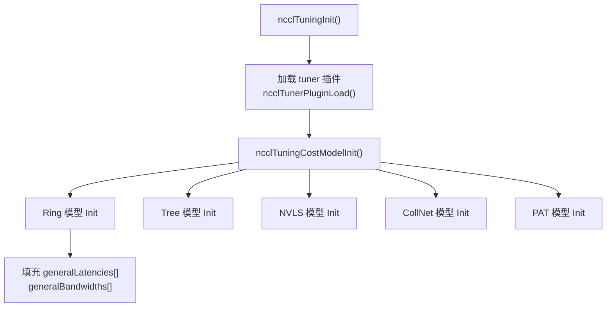
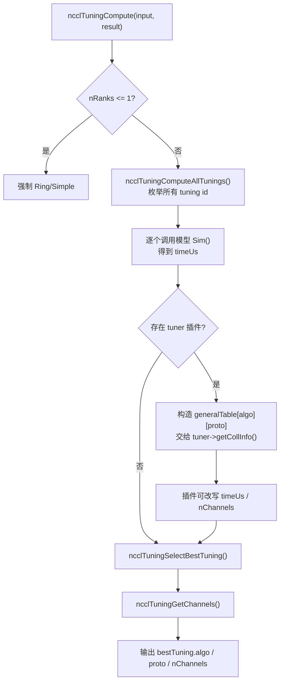

# NCCL host 侧：代价表的建立与算法选择

> 基于本仓库 NCCL 2.31.2 源码。  
> 主线文件：`src/collectives.cc`、`src/enqueue/enqueue.cc`、`src/group.cc`、`src/tuning/*`、`src/include/tuning.h`。  
> 这是上一篇《NCCL 拓扑建立与算法搜索》的姊妹篇：上一篇讲“初始化时怎么把物理图变成 ring/tree”，这一篇讲“运行时一次 `ncclAllGather` 怎么选算法和协议”。

## 0. 先说明：`topoGetAlgoInfo` 与 `costTable` 的版本沿革

在 NCCL 2.18 及更早版本里，算法选择逻辑集中在 `src/graph/tuning.cc`：

- 初始化时 `ncclTopoTuneModel()` 根据 `comm->graphs[]` 里的拓扑带宽，生成 `bandwidths[algo][proto]` 和 `latencies[algo][proto]` 两张表；
- 每次 collective 通过 `topoGetAlgoInfo()` 查这两张表，估算 `time = latency + nBytes/bandwidth`，选最小值。

这个“二维代价表 + 查表选最小”的心智模型，到今天依然成立，但实现已经重构：

- `topoGetAlgoInfo()` 没了，替代者是 `ncclGetAlgoInfo()` → `ncclTuningCompute()`；
- 静态二维表变成了 `ncclTuningContext` 里的 `generalLatencies[]` / `generalBandwidths[]`；
- 运行时还会构造一张 `generalTable[algo][proto]` 快照，传给 tuner 插件，插件接口里就叫 `collCostTable`。

所以你说“里面有一个重要的结构是 costtable”，完全正确，只是它在 2.31 里换了形态。

## 1. 实际调用链

当前代码：

```text
ncclAllGather()
  -> ncclAllGatherConfigImpl()          // 构造 ncclInfo
  -> ncclEnqueueCheck()
       -> ncclGroupStartInternal()
       -> taskAppend()                  // 先把任务挂到 planner
       -> ncclGroupEndInternal()
            -> groupLaunch()            // legacy / enqueue rearch 二选一
                 -> ncclPrepareTasksAndCollPreconnect()
                      -> ncclPrepareTasks()
                           -> ncclGetAlgoInfo()
                                -> ncclTuningCompute()   // 旧版 topoGetAlgoInfo 的继承者
```

对应到 Mermaid：

```mermaid
flowchart LR
  A["ncclAllGather()"] --> B["ncclAllGatherConfigImpl()<br/>构造 ncclInfo"]
  B --> C["ncclEnqueueCheck()"]
  C --> D["ncclGroupStartInternal()"]
  D --> E["taskAppend()<br/>任务挂入 planner.collSorter"]
  E --> F["ncclGroupEndInternal()"]
  F --> G["groupLaunch()"]
  G --> H["ncclPrepareTasksAndCollPreconnect()"]
  H --> I["ncclPrepareTasks()"]
  I --> J["ncclGetAlgoInfo()"]
  J --> K["ncclTuningCompute()<br/>代价表 + 选最小"]
```



一个很重要的点：`taskAppend` 阶段**不做算法选择**，它只是把 collective 变成 `ncclTaskColl` 并塞进 `planner.collSorter`。真正的选择延迟到 `ncclGroupEnd()` 才发生。

## 2. `ncclAllGather`：只构造一个 `ncclInfo`

公开 API 很薄，核心就是填充 `ncclInfo` 然后交给 enqueue：

```c
// src/collectives.cc
static inline ncclResult_t ncclAllGatherConfigImpl(...) {
  struct ncclInfo info = {ncclFuncAllGather, "AllGather",
                          sendbuff, recvbuff, sendcount, datatype,
                          ncclSum, 0, comm, stream,
                          ALLGATHER_CHUNKSTEPS, ALLGATHER_SLICESTEPS};
  NCCLCHECK(ncclParseCollConfig(config, &info.collConfig));
  return ncclEnqueueCheck(&info);
}
```

这里 `ncclInfo` 只是“用户请求的搬运工”，还不包含 algorithm / protocol 的决策结果。

## 3. `taskAppend`：先挂任务，不选算法

`taskAppend` 的职责是把 `ncclInfo` 转成任务并放进 `comm->planner`：

```c
// src/enqueue/enqueue.cc
static ncclResult_t taskAppend(struct ncclComm* comm, struct ncclInfo* info) {
  ncclFunc_t collAPI = info->coll;
  if (ncclParamEnqueueRearchEnable()) {
    NCCLCHECK(rawTaskAppend(comm, info));
  } else if (info->coll == ncclFuncSend || info->coll == ncclFuncRecv) {
    NCCLCHECK(p2pTaskAppend(...));
  } else if (/* PutSignal / Signal / WaitSignal */) {
    NCCLCHECK(rmaTaskAppend(comm, info));
  } else {
    // ...
    NCCLCHECK(collTaskAppend(comm, info, opDev));  // collective 进 collSorter
  }
}
```

对于 AllGather 这种 collective，最终走 `collTaskAppend`。注意它已经处理了一些前置决策，例如单 rank 直接退化为 memcpy、CE 路径、AlltoAll/Gather/Scatter 降级为 send/recv 等；但 ring/tree/NVLS 的最终选择仍要等到 group end。

## 4. `ncclGroupEndInternal` 与 `groupLaunch`

`ncclEnqueueCheck` 的尾部会调用 `ncclGroupEndInternal()`，真正的 group 执行从这里开始：

```c
// src/group.cc
static ncclResult_t groupLaunch(struct ncclAsyncJob* job_, ncclSimInfo_t* simInfo = NULL) {
  return ncclParamEnqueueRearchEnable()
           ? groupLaunchEnqueueRearch(job_, simInfo)
           : groupLaunchLegacy(job_, simInfo);
}
```

也就是说当前有两套执行路径：

- `groupLaunchLegacy`：传统路径；
- `groupLaunchEnqueueRearch`：新的 enqueue 重构路径。

在 legacy 路径里，对每个 collective communicator 会调用 `ncclPrepareTasksAndCollPreconnect()`，它内部再调用 `ncclPrepareTasks()`。

## 5. `ncclPrepareTasks`：聚合任务并触发算法选择

`ncclPrepareTasks` 是“每 group 一次”的任务组织函数。它会先把 `collSorter` 里的任务取出来，按 `(func, op, datatype)` 分桶，然后在桶内做尺寸聚合，再对每个聚合后的任务调用 `ncclGetAlgoInfo()`：

```c
// src/enqueue/enqueue.cc
// Tasks from the sorter come out ordered size descending.
struct ncclTaskColl* task = ncclTaskCollSorterDequeueAll(&planner->collSorter);

for (int cursor = 0; cursor < fnOpTyCount; cursor++) {
  struct ncclTaskColl* aggBeg = tasksByFnOpTy[fnOpTyIndices[cursor]];
  int collNetSupport = 0;
  ncclGetCollNetSupport(comm, aggBeg, &collNetSupport);
  int nvlsSupport = ...;
  int nTasksPerChannel = divUp(comm->planner.nTasksColl, comm->nChannels);
  do {
    struct ncclTaskColl agg = *aggBeg;
    // We aggregate operations that are within 4X size of each other.
    while (aggEnd != nullptr && aggEnd->trafficBytes < 4 * aggBeg->trafficBytes &&
           !aggBeg->aggIsolate && !aggEnd->aggIsolate) {
      agg.count += aggEnd->count;
      agg.trafficBytes += aggEnd->trafficBytes;
      aggEnd = aggEnd->next;
    }

    NCCLCHECK(ncclGetAlgoInfo(comm, &agg, collNetSupport, nvlsSupport,
                              nTasksPerChannel, simInfo));
    agg.devFuncId = ncclDevFuncId(agg.func, agg.opDev.op, agg.datatype,
                                  agg.algorithm, agg.protocol);
    ...
  } while (...);
}
```

这段代码的几个要点：

- 按尺寸从大到小处理；
- 大小差距在 4 倍以内的任务会被聚合，减少 kernel launch 次数；
- `collNetSupport` 和 `nvlsSupport` 是算法选择的“准入条件”；
- `ncclGetAlgoInfo` 返回 `algorithm` / `protocol`，之后据此算出 `devFuncId`（对应设备端 kernel）。

## 6. `ncclGetAlgoInfo`：构造输入，调用 tuning

`ncclGetAlgoInfo` 现在只是 `ncclTuningCompute` 的适配层：

```c
// src/enqueue/enqueue.cc
ncclResult_t ncclGetAlgoInfo(struct ncclComm* comm, struct ncclTaskColl* info,
                             int collNetSupport, int nvlsSupport,
                             int numPipeOps, ncclSimInfo_t* simInfo) {
  size_t elementSize = ncclTypeSize(info->datatype);
  size_t nBytes = elementSize *
                  ncclFuncMaxSendRecvCount(info->func, comm->nRanks, info->count);

  struct ncclTuningInput_t input;
  input.comm = comm;
  input.tuningMask = NCCL_TUNING_MASK_GENERAL_KERNELS;
  input.func = info->func;
  input.redOp = info->opHost;
  input.devRedOp = info->opDev.op;
  input.datatype = info->datatype;
  input.nBytes = nBytes;
  input.numPipeOps = numPipeOps;
  input.collNetSupport = collNetSupport;
  input.nvlsSupport = nvlsSupport;
  input.count = info->count;
  NCCLCHECK(ncclGetRegBuff(comm, info, &input.regBuff));

  struct ncclTuningResult_t bestTuning = NCCL_TUNING_RESULT_INIT;
  NCCLCHECK(ncclTuningCompute(&input, &bestTuning));

  info->algorithm = bestTuning.algo;
  info->protocol = bestTuning.proto;
  info->nWarps = bestTuning.nWarps;
  info->nMaxChannels = bestTuning.maxChannels == 0
                         ? info->nMaxChannels : bestTuning.maxChannels;
  return ncclSuccess;
}
```

它把 collective 的上下文打包成 `ncclTuningInput_t`，再交给 `ncclTuningCompute` 做真正的模拟和选择。

## 7. 代价表到底存在哪里

2.31 里“代价表”的核心在 `comm->tuningContext`：

```c
// src/include/tuning.h
struct ncclTuningContext_t {
  ncclTunerConstants_t tuningConstants;
  int forced[NCCL_NUM_FUNCTIONS];
  int enabled[NCCL_TUNING_COUNT][NCCL_NUM_FUNCTIONS];
  float generalLatencies[NCCL_NUM_FUNCTIONS]
                        [NCCL_NUM_ALGORITHMS]
                        [NCCL_NUM_PROTOCOLS];
  float generalBandwidths[NCCL_NUM_FUNCTIONS]
                         [NCCL_NUM_ALGORITHMS]
                         [NCCL_NUM_PROTOCOLS];
  ssize_t threadThresholds[NCCL_NUM_ALGORITHMS][NCCL_NUM_PROTOCOLS];
  int maxThreads[NCCL_NUM_ALGORITHMS][NCCL_NUM_PROTOCOLS];
};
```

这两张表就是“代价表”：

- `generalLatencies[func][algo][proto]`：该算法/协议在该 function 下的基础延迟；
- `generalBandwidths[func][algo][proto]`：该算法/协议的有效带宽。

算法和协议的编号在 `src/include/plugin/nccl_tuner.h`：

```c
#define NCCL_ALGO_TREE           0
#define NCCL_ALGO_RING           1
#define NCCL_ALGO_COLLNET_DIRECT 2
#define NCCL_ALGO_COLLNET_CHAIN  3
#define NCCL_ALGO_NVLS           4
#define NCCL_ALGO_NVLS_TREE      5
#define NCCL_ALGO_PAT            6

#define NCCL_PROTO_LL    0
#define NCCL_PROTO_LL128 1
#define NCCL_PROTO_SIMPLE 2
```

所以整张表是一个 `function × algorithm × protocol` 的三维结构。

## 8. 代价表如何建立：初始化阶段

代价表不是在每次 collective 时才现算带宽，而是 communicator 初始化时一次性建好。



模型注册表在 `src/tuning/cost_model.cc`：

```c
static struct ncclTuningModelEntry_t modelMap[] = {
  {ncclTuningTreeModelInit,    ncclTuningTreeModelSim,    nullptr, {0,0,0,0,1}}, // Tree/LL
  {ncclTuningTreeModelInit,    ncclTuningTreeModelSim,    nullptr, {0,0,0,0,1}}, // Tree/LL128
  {ncclTuningTreeModelInit,    ncclTuningTreeModelSim,    nullptr, {0,0,0,0,1}}, // Tree/Simple
  {ncclTuningRingModelInit,    ncclTuningRingModelSim,    nullptr, {1,1,1,1,1}}, // Ring/LL
  {ncclTuningRingModelInit,    ncclTuningRingModelSim,    nullptr, {1,1,1,1,1}}, // Ring/LL128
  {ncclTuningRingModelInit,    ncclTuningRingModelSim,    nullptr, {1,1,1,1,1}}, // Ring/Simple
  ...
};
```

`enabled` 数组表示该模型在哪些 function 上可用，例如 Ring 几乎全 function 可用，Tree 主要服务于 AllReduce，CollNet/NVLS 只支持 Simple 协议等。

以 Ring 为例，看带宽是怎么算出来的：

```c
// src/tuning/ring.cc
int nSteps = ncclTuningGetNsteps(c, comm->nRanks);
float bw = (comm->nNodes == 1 || ...) ? comm->graphs[algo].bwIntra
                                       : comm->graphs[algo].bwInter;
float busBw = bw * comm->graphs[algo].nChannels;
if (proto == NCCL_PROTO_LL) {
  busBw = std::min(llMaxBw, busBw * .5);
}
if (proto == NCCL_PROTO_LL128) {
  busBw = std::min(busBw * (0.92), comm->graphs[algo].nChannels * perChMaxRingLL128Bw);
}

comm->tuningContext.generalLatencies[c][algo][proto] =
  comm->tuningContext.tuningConstants.baseLatencies[algo][proto];
comm->tuningContext.generalBandwidths[c][algo][proto] =
  busBw * comm->nRanks / nSteps;
```

可以看到：

- 基础带宽来自上一篇文章搜出来的 `comm->graphs[algo].bwIntra / bwInter`；
- 再乘以 channel 数得到总线带宽 `busBw`；
- LL / LL128 有自己的上限修正；
- 延迟来自 `baseLatencies` 和 `hwLatencies` 常量表。

`ncclTuningGetNsteps` 用“步数”把总线带宽折算成单次 collective 的有效带宽：

```c
// src/tuning/tuning_general.cc
int ncclTuningGetNsteps(int coll, int nRanks) {
  if (coll == ncclFuncAllReduce) return 2 * (nRanks - 1);
  if (coll == ncclFuncReduceScatter || coll == ncclFuncAllGather) return nRanks - 1;
  return nRanks;
}
```

## 9. 代价如何计算：线性模型

所有算法模型最终都会调用同一个时间估算函数：

```c
// src/tuning/tuning_general.cc
float ncclTuningGetTime(struct ncclTuningInput_t* const inputs,
                        int a, float* lat, float* bw) {
  int latCount = a == NCCL_ALGO_RING
                   ? inputs->numPipeOps
                   : DIVUP(inputs->numPipeOps, NCCL_MAX_DEV_WORK_BATCH_COLLS);

  float precision_ratio = 1.0;
  if (inputs->datatype == ncclFloat8e4m3 || inputs->datatype == ncclFloat8e5m2) {
    if (a == NCCL_ALGO_RING && inputs->comm->nRanks > 8) {
      precision_ratio = 1024.0;
    }
  }

  return (*lat * latCount + inputs->nBytes / (1000 * (*bw))) * precision_ratio;
}
```

也就是：

```text
timeUs = (latency × latCount + nBytes / (1000 × bandwidth)) × precision_ratio
```

单位上，`latency` 是微秒，`bandwidth` 是 GB/s，`nBytes` 是字节。`nBytes / bandwidth` 先得到纳秒，除以 1000 转成微秒。

所以 NCCL 的代价模型本质是“延迟项 + 带宽项”的线性模型，再叠加上一些工程修正（比如 Ring Simple 在大消息时乘以 plateau 系数、FP8 深环的精度惩罚）。

## 10. 算法如何选择：`ncclTuningCompute`

运行时选择逻辑在 `src/tuning/tuning.cc`，大致流程：



枚举和选择的核心：

```c
// src/tuning/tuning.cc
ncclResult_t ncclTuningComputeAllTunings(input, tunings) {
  for (int i = 0; i < NCCL_TUNING_COUNT; i++) {
    struct ncclTuningResult_t tuning = NCCL_TUNING_RESULT_INIT;
    tuning.id = i;
    if (!(input->tuningMask & (1lu << i))) continue;  // 被 mask 排除
    ncclTuningExpandId(i, &tuning.algo, &tuning.proto,
                       &tuning.symKernelId, &tuning.ceMethodId);
    ncclTuningComputeTuning(i, input, &tuning);
    if (tuning.valid) ncclTuningResultListPushFront(tunings, tuning);
  }
}

static ncclResult_t ncclTuningSelectBestTuning(tunings, bestTuning) {
  bestTuning->timeUs = FLT_MAX;
  while (node != nullptr) {
    if (tuning.timeUs < bestTuning->timeUs) *bestTuning = tuning;
    node = node->next;
  }
}
```

关键点：

- `tuningMask` 决定了哪些算法/协议/symmetric kernel/CE 方法可以参与竞争；
- 每个候选调用对应模型的 `Sim()`，得到 `timeUs`；
- 有 tuner 插件时，NCCL 会把 `generalTable[algo][proto]`（也就是插件看到的 `collCostTable`）交给插件，插件可以改写；
- 最终选 `timeUs` 最小的那个。

`ncclTuningExpandId` 把一维 tuning id 还原成算法/协议/对称 kernel/CE 方法：

```c
// src/tuning/tuning_general.cc
if (tuningId < NCCL_NUM_ALGORITHMS * NCCL_NUM_PROTOCOLS) {
  *algo = tuningId / NCCL_NUM_PROTOCOLS;
  *proto = tuningId % NCCL_NUM_PROTOCOLS;
} else if (tuningId < NCCL_TUNING_CE_METHOD_ID_OFFSET) {
  *symKernelId = tuningId - NCCL_NUM_ALGORITHMS * NCCL_NUM_PROTOCOLS;
} else {
  *ceMethodId = tuningId - NCCL_TUNING_CE_METHOD_ID_OFFSET;
}
```

所以现在的候选空间不只是 `algo × proto`，还包含了 symmetric kernel 和 CE 方法。

## 11. 选中算法之后

`ncclGetAlgoInfo` 拿到 `bestTuning` 后，会设置：

- `algorithm` / `protocol`；
- `nWarps`（每个 kernel 的 warp 数）；
- `nMaxChannels`；
- `devFuncId`（对应设备端 kernel 函数）。

随后 `ncclPrepareTasks` 会把这些任务按调度约束分桶（collnet × nvls），再进入后面的 chunking、channel 分配和 kernel/proxy 下发。

换句话说，算法选择只是“调度”的前半段：

```text
选 algo/proto -> 算 chunk -> 分配 channel/CTA -> 生成 kernel plan -> launch
```

## 12. 总结：从“查表选最小”到“tuning 框架”

如果把两篇文章连起来看，NCCL host 侧其实是两个阶段：

1. 初始化阶段：建物理拓扑 → 搜逻辑图 → 用图上的带宽/延迟建立代价表；
2. 运行时阶段：任务挂载 → 聚合 → 用代价表模拟候选算法 → 选最小代价 → 生成执行计划。

“代价表 + 算法选择”是第二阶段的核心，而它的输入正是第一阶段的 `comm->graphs[]`。这也再次印证了我的观点：NCCL 的本质是一套资源匹配系统，代价表就是它用来度量“哪种资源组合更便宜”的核心数据结构。

## 参考源码

- API 入口：`src/collectives.cc`
- 任务挂载与 enqueue：`src/enqueue/enqueue.cc`（`taskAppend`、`ncclEnqueueCheck`、`ncclPrepareTasks`、`ncclGetAlgoInfo`）
- group 执行：`src/group.cc`（`groupLaunch`、`ncclGroupEndInternal`、`ncclPrepareTasksAndCollPreconnect`）
- tuning 框架：`src/tuning/tuning.cc`、`src/tuning/cost_model.cc`、`src/tuning/tuning_general.cc`
- 各算法代价模型：`src/tuning/ring.cc`、`tree.cc`、`nvls.cc`、`collnet.cc`、`pat.cc`
- 数据结构：`src/include/tuning.h`、`src/include/plugin/nccl_tuner.h`
