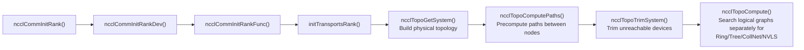
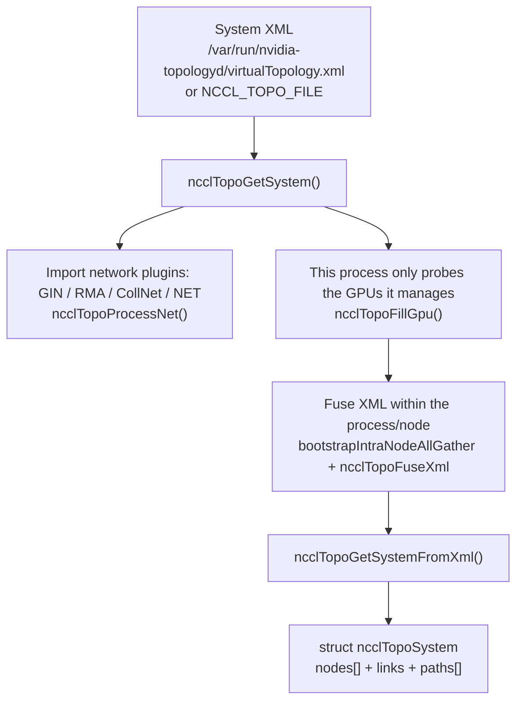
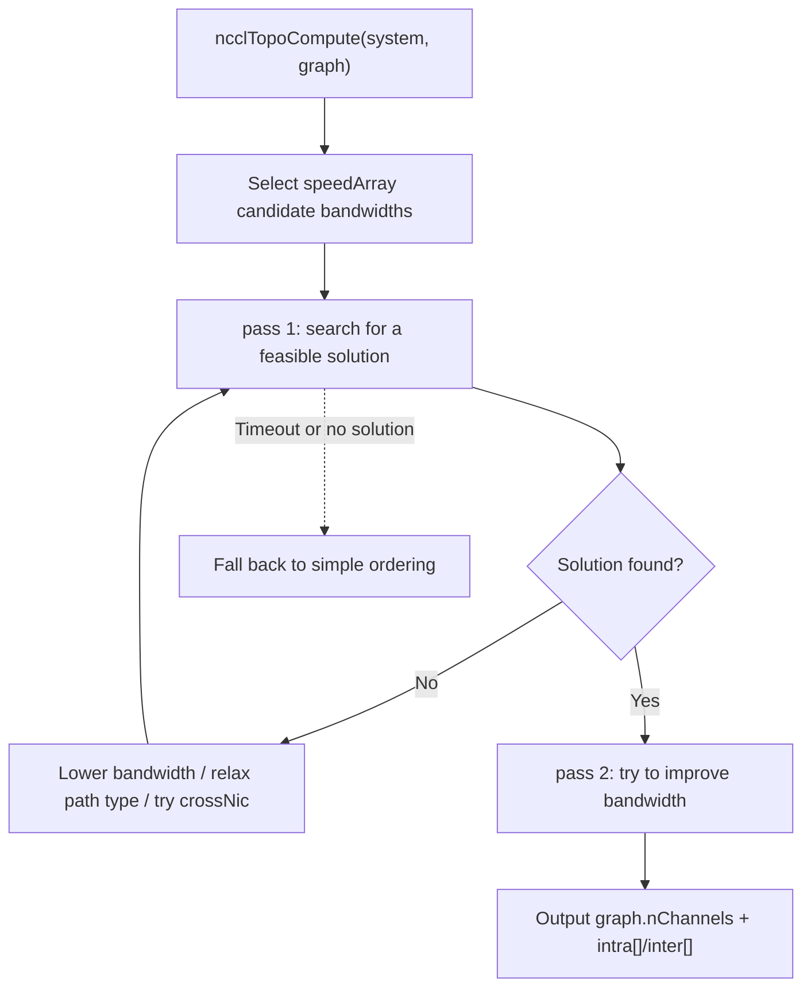
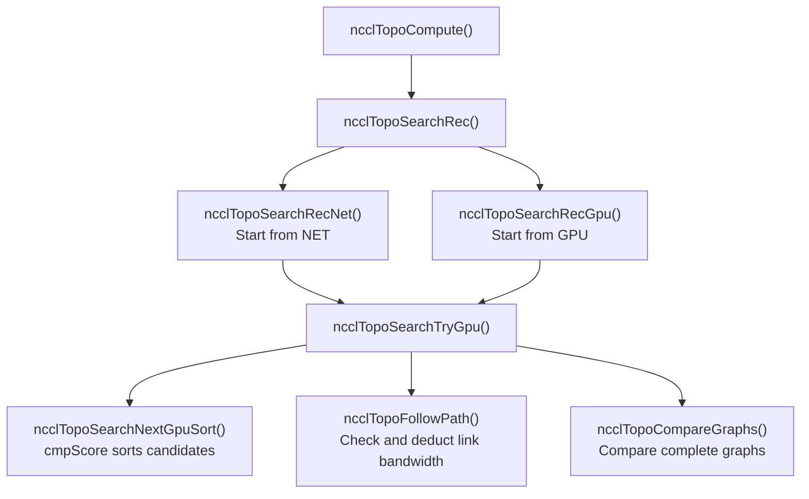
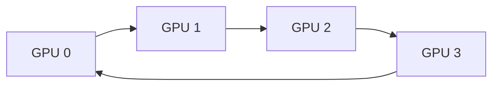
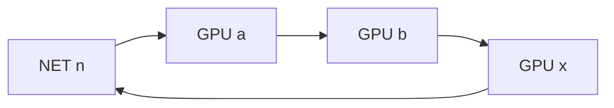
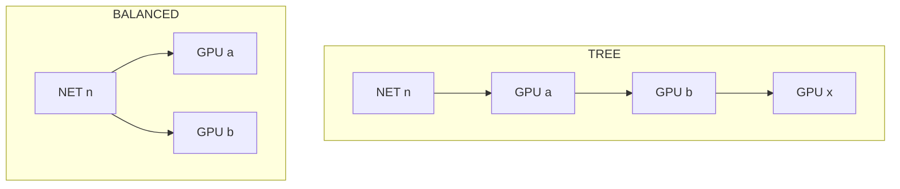

# NCCL Host-Side Core: Topology Construction and Algorithm Search

> Based on the NCCL 2.31.2 source code in this repository.  
> Main files: `src/init.cc`, `src/graph/topo.cc`, `src/graph/paths.cc`, `src/graph/search.cc`, `src/include/graph.h`.  
> The Mermaid diagrams in this document require a renderer that supports Mermaid (GitHub / GitLab / Typora / Obsidian / VSCode plugin).

## Why host-side "topology + search" is the core

NCCL is exposed to users as a GPU collective-communication library, but its real difficulty is not "moving data from A to B." It is:

> For one collective operation, select the **most appropriate logical paths and execution plan** on the **current physical machine topology**.

The "resources" here are layered:

- Physical resources: GPUs, NVSwitch, PCIe, NUMA/CPU, NICs, and the network.
- Logical resources: communication graphs such as ring, tree, NVLS, and CollNet.
- Execution resources: the number of channels, transport type, protocol, number of CTAs, and chunk size.

Therefore, the two truly important host-side steps are:

1. **Topology construction**: turn the real connections between GPUs, and between GPUs and NICs, into a graph.
2. **Algorithm search**: on that graph, search for the paths that data will actually take for algorithms such as ring / tree / NVLS / CollNet.

This document focuses on those two steps.

## 0. Global call chain

One `ncclCommInitRank` call eventually performs topology construction and graph search inside `initTransportsRank()`:



The actual call order in `src/init.cc` is:

```c
// src/init.cc
// Topo detection / System graph creation
ncclTopoGetSystem(comm, &comm->topo);
// Compute paths between GPUs and NICs
ncclTopoComputePaths(comm->topo, comm);
// Remove inaccessible GPUs and unused NICs
ncclTopoTrimSystem(comm->topo, comm);
// Recompute paths after trimming
ncclTopoComputePaths(comm->topo, comm);
// Init search
ncclTopoSearchInit(comm->topo);
```

Only after this sequence is complete does NCCL call `ncclTopoCompute()` individually for `ringGraph`, `treeGraph`, `collNetGraph`, and `nvlsGraph`.

## 1. Physical topology: `ncclTopoSystem`

The entry point for physical topology is `ncclTopoGetSystem()`, located in `src/graph/topo.cc`. It answers the question:

> On this machine, how exactly are the GPUs, PCIe, CPU/NUMA, and NICs connected?

The construction process can be summarized as:



Several key facts:

- By default, NCCL prefers to read the system `virtualTopology.xml`; it can also be overridden with `NCCL_TOPO_FILE`.
- Each rank initially knows only local information about "its own GPU." NCCL uses bootstrap to merge the XML from every rank in the same node and reconstruct the complete topology.
- Network devices do not appear out of nowhere. They are imported through the net / gin / rma / collnet plugins, and `ncclTopoProcessNet()` converts them into NET nodes in the topology.

`ncclTopoSystem` contains many node types, not only GPUs:

```c
// src/graph/topo.h
#define GPU 0
#define PCI 1
#define NVS 2
#define CPU 3   // Actually represents a NUMA domain
#define NIC 4
#define NET 5
#define GIN 6
#define RMA 7
#define DEV 8
#define CXB 9  // C2C Cross-Bridge
```

Each node has several `links`, and each link has a type and bandwidth. This structure is the "physical topology."

## 2. Path precomputation: `ncclTopoComputePaths`

Having a physical graph is not enough. When searching for ring/tree, NCCL needs to quickly answer:

> What path should be used from GPU A to GPU B? Is it a direct NVLink connection, through a PCIe bridge, or around the CPU?

This step is completed in `ncclTopoComputePaths()` in `src/graph/paths.cc`, and its core is `ncclTopoSetPaths()`.

Notably, it is not Dijkstra; it is **breadth-first search (BFS)**, as the source comment states:

```c
// src/graph/paths.cc
// breadth-first search to set all paths to that node in the system
static ncclResult_t ncclTopoSetPaths(struct ncclTopoNode* baseNode,
                                     struct ncclTopoSystem* system)
```

Path comparison is not simply "whoever has the highest bandwidth." It is a tuple:

1. A better path type (numerically smaller means "closer").
2. For the same type, higher bandwidth.
3. For the same type and bandwidth, fewer hops.

The corresponding decision in the source code is:

```c
// Update if better path type, OR same type with higher bw,
// OR same type/bw with strictly fewer hops.
if (newType < remPath->type ||
    (newType == remPath->type && remPath->bw < bw) ||
    (newType == remPath->type && remPath->bw == bw &&
     remPath->count > (path->count + 1))) {
  ...
}
```

Path types are defined in `src/include/graph.h` and, from nearest to farthest, are roughly:

| Type | Meaning |
| --- | --- |
| `PATH_LOC` | The current node |
| `PATH_NVL` | Direct NVLink |
| `PATH_NVB` | NVLink through one intermediate GPU |
| `PATH_C2C` | C2C interconnect |
| `PATH_PIX` | A single PCIe bridge |
| `PATH_PXB` | Multiple PCIe bridges (without passing through the Host Bridge) |
| `PATH_P2C` / `PATH_PXN` | Special GPU-NIC paths |
| `PATH_PHB` | Through the PCIe Host Bridge (usually around the CPU) |
| `PATH_SYS` | Cross-NUMA SMP interconnect (QPI/UPI) |
| `PATH_NET` | Through the network |
| `PATH_DIS` | Unreachable |

`ncclTopoComputePaths` also rewrites paths depending on P2P / GDR / PXN: for example, when GPU Direct P2P is not allowed it forces traffic around the CPU, and when PXN is allowed it forwards NIC traffic through a neighboring GPU connected by NVLink.

After this step, every node in `ncclTopoSystem` carries precomputed paths to the other GPUs / NICs. This becomes the "raw material" for the algorithm search that follows.

## 3. Logical topology: `ncclTopoGraph`

The physical topology is "what the machine looks like"; the logical topology is "which paths the data will take."

```c
// src/include/graph.h
struct ncclTopoGraph {
  int id;            // ring:0, tree:1, collnet:2, nvls:3, collnetDirect:4
  int pattern;       // Which logical topology
  int crossNic;
  int collNet;
  int minChannels;
  int maxChannels;
  // Outputs
  int nChannels;
  float bwIntra;     // Intra-node bandwidth
  float bwInter;     // Inter-node bandwidth
  int typeIntra;
  int typeInter;
  int sameChannels;
  int nHops;
  int intra[MAXCHANNELS * NCCL_TOPO_MAX_NODES]; // GPU order for each channel
  int64_t inter[MAXCHANNELS * 2];               // NET used by each channel
};
```

`pattern` is not limited to ring and tree. This version defines:

```c
#define NCCL_TOPO_PATTERN_BALANCED_TREE 1
#define NCCL_TOPO_PATTERN_SPLIT_TREE    2
#define NCCL_TOPO_PATTERN_TREE          3
#define NCCL_TOPO_PATTERN_RING          4
#define NCCL_TOPO_PATTERN_NVLS          5
#define NCCL_TOPO_PATTERN_COLLNET_DIRECT 6
```

`intra[]` stores "the GPU ordering on channel c," while `inter[]` stores the NIC used by that channel. These are the direct outputs of the search.

## 4. Search entry point: `ncclTopoCompute`

`ncclTopoCompute()` is the entry point for searching each algorithm, located in `src/graph/search.cc`. Its working pattern is:

1. Select a suitable candidate bandwidth list `speedArray` based on compute capability (`ccMin`).
2. Starting from the highest bandwidth, use DFS to attempt a search.
3. If no solution is found, progressively lower the bandwidth, relax path types, or try crossNic.
4. Use two passes (pass 1 / pass 2): first find a feasible solution, then try to improve bandwidth.
5. If truly no solution is found, fall back to a "simple ordering."



The search has an explicit **time budget** to prevent unbounded enumeration on very large topologies:

```c
#define NCCL_SEARCH_GLOBAL_TIMEOUT (1ULL << 19)
#define NCCL_SEARCH_TIMEOUT        (1 << 14)
#define NCCL_SEARCH_TIMEOUT_TREE   (1 << 14)
#define NCCL_SEARCH_TIMEOUT_SAMECHANNELS (1 << 8)
```

## 5. Recursive search core: DFS + backtracking

The actual search dispatch function is `ncclTopoSearchRec()`:

```c
ncclResult_t ncclTopoSearchRec(struct ncclTopoSystem* system,
                               struct ncclTopoGraph* graph,
                               struct ncclTopoGraph* saveGraph, int* time) {
  int backToNet, backToFirstRank;
  ncclTopoSearchParams(system, graph->pattern, &backToNet, &backToFirstRank);
  if (system->inter) {
    // Inter-node: start from NET
    ncclTopoSearchRecNet(system, graph, saveGraph, backToNet, backToFirstRank, time);
  } else {
    // Single node: start from GPU
    ...
  }
}
```

The call relationships can be drawn as:



### 5.1 Starting from NET: `ncclTopoSearchRecNet`

For inter-node communication, ring/tree must choose a NIC as the starting point. `ncclTopoSearchRecNet()` does the following:

1. `ncclTopoSelectNets()` selects candidate NICs.
2. Checks NIC bandwidth, CollNet support, and crossNic constraints.
3. Writes the selected NET into `graph->inter[]` and deducts the NIC bandwidth.
4. Uses one local GPU as the entry point and enters `ncclTopoSearchTryGpu()` / `ncclTopoSearchRecGpu()`.
5. During backtracking, adds the NIC bandwidth back.

There is a very typical "try a cheap answer first" heuristic inside:

```c
if (graph->nChannels == 0 && system->nodes[NVS].count == 0) {
  // Always try the PCI order first to set a reference
  ncclTopoSearchTryGpu(..., FORCED_ORDER_PCI, ...);
}
```

That is, the first channel is first run in PCI order as a baseline before the real search begins.

### 5.2 Recursion on GPUs: `ncclTopoSearchRecGpu`

This is the core DFS + backtracking routine. At each step it places one GPU into `graph->intra[...]`, then recursively chooses the next GPU:

```c
graph->intra[graph->nChannels * ngpus + step] = gpu->gpu.rank;
...
for (int i = 0; i < count; i++) {
  int nextIndex = next ? next[i] : nextGpu;
  ncclTopoSearchTryGpu(system, graph, saveGraph, step + 1,
                       backToNet, backToFirstRank, forcedOrder,
                       time, GPU, g, nextIndex);
}
```

There are two key states:

- `backToNet`: at which step to return to the NIC.
- `backToFirstRank`: at which step to return to the first GPU and close the ring.

They are determined by `ncclTopoSearchParams()` based on `pattern`:

```c
if (system->inter) {
  if (pattern == NCCL_TOPO_PATTERN_RING) *backToNet = GPU.count - 1;
  else if (pattern == NCCL_TOPO_PATTERN_SPLIT_TREE) *backToNet = 1;
  else *backToNet = 0;
  *backToFirstRank = -1;
} else {
  *backToNet = -1;
  if (pattern == NCCL_TOPO_PATTERN_RING) *backToFirstRank = GPU.count - 1;
  else *backToFirstRank = -1;
}
```

This explains the core difference between ring and tree.

## 6. Sorting heuristic: `cmpScore`

At each DFS step, "which GPU to choose next" is decided by `ncclTopoSearchNextGpuSort()`, whose sort key is `cmpScore()`:

```c
struct ncclGpuScore {
  int g;             // GPU index
  int startIndex;    // Least important; used only to break ties
  int intraNhops;
  int intraBw;
  int interNhops;
  int interPciBw;
  int interBw;       // Most important
};

static int cmpScore(const void* g1, const void* g2) {
  struct ncclGpuScore* s1 = (struct ncclGpuScore*)g1;
  struct ncclGpuScore* s2 = (struct ncclGpuScore*)g2;
  int d;
  if ((d = (s2->interBw    - s1->interBw)))    return d;
  if ((d = (s2->interPciBw - s1->interPciBw))) return d;
  if ((d = (s1->interNhops - s2->interNhops))) return d;
  if ((d = (s2->intraBw    - s1->intraBw)))    return d;
  if ((d = (s1->intraNhops - s2->intraNhops))) return d;
  return s1->startIndex - s2->startIndex;
}
```

The priority from high to low is:

| Priority | Field | Direction |
| --- | --- | --- |
| 1 | Inter-node network bandwidth `interBw` | Higher is better |
| 2 | PCIe bandwidth to the network `interPciBw` | Higher is better |
| 3 | Hops to the network `interNhops` | Fewer is better |
| 4 | GPU-to-GPU bandwidth `intraBw` | Higher is better |
| 5 | GPU-to-GPU hops `intraNhops` | Fewer is better |
| 6 | Starting offset `startIndex` | Only breaks ties |

In one sentence: **inter-node capability takes priority over intra-node capability; bandwidth takes priority over hop count.**

One detail to note: `interBw / interPciBw / interNhops` are only populated when `sortNet != 0` (that is, when the next step must return to the network). For purely intra-node sorting these three fields are zero, so the comparison degenerates to only `intraBw / intraNhops`.

In addition, when NVSwitch is present, `ncclTopoSearchNextGpuSort()` forcibly moves neighboring GPUs earlier and keeps only neighbors as candidates. This shows that the heuristic is not rigidly score-based.

## 7. Link-capacity deduction and whole-graph comparison

Many people assume NCCL's search "only looks locally and does not consider the whole ring." In reality, this must be viewed on two levels.

### 7.1 Local deduction: `followPath`

While DFS constructs a channel, every step actually deducts link bandwidth:

```c
static ncclResult_t followPath(struct ncclTopoLinkList* path,
                               struct ncclTopoNode* start,
                               int maxSteps, float bw, int* steps) {
  ...
  if (link->bw < fwBw || (revBw && revLink->bw < revBw)) {
    *steps = step;
    return ncclSuccess;   // Insufficient bandwidth; stop at this step
  }
  SUB_ROUND(link->bw, fwBw);          // Forward deduction
  if (revBw) SUB_ROUND(revLink->bw, revBw); // Reverse deduction
  ...
}
```

`ncclTopoFollowPath()` uses `mult == 1` to mean "occupy bandwidth" and `mult == -1` to mean "return bandwidth during backtracking." Therefore:

- `cmpScore` is only a **sorting heuristic** and indeed does not know about link occupancy.
- But the DFS itself has **link-capacity accounting** and avoids overusing a link within a single channel.

### 7.2 Whole-graph comparison: `ncclTopoCompareGraphs`

Whenever a complete channel is constructed, it is compared with the current best graph:

```c
ncclResult_t ncclTopoCompareGraphs(struct ncclTopoSystem* system,
                                   struct ncclTopoGraph* graph,
                                   struct ncclTopoGraph* refGraph, int* copy) {
  // 1. Prefer matching the number of Ring and Tree channels
  if (graph->nChannels < graph->minChannels) return ncclSuccess;
  ...
  // 2. Prefer higher total bandwidth
  if (graph->nChannels * graph->bwIntra > refGraph->nChannels * refGraph->bwIntra) {
    *copy = 1;
    return ncclSuccess;
  }
  ...
  // 3. Fewer hops
  if (graph->nHops < refGraph->nHops) *copy = 1;
}
```

So a more accurate description is: **the search order is locally greedy, but complete solutions receive global comparison.** It does not compute a globally optimal solution over all permutations, but it does not ignore the whole ring either.

## 8. Specific differences between Ring and Tree

### 8.1 Ring: closing the loop

Within a single node, ring is `GPU0 -> GPU1 -> ... -> GPUn-1 -> GPU0`:



This corresponds to `backToFirstRank = GPU.count - 1`: at the last step, the last GPU is connected back to the first GPU, closing the ring.

An inter-node ring is:



Here `backToNet = GPU.count - 1`: starting from NET, traverse all GPUs and then return to the same NET.

### 8.2 Tree: no loop, but parent/child assignment

A tree does not need to close, but it must assign "who is responsible for entering and leaving the network." The differences between `NCCL_TOPO_PATTERN_TREE`, `BALANCED_TREE`, and `SPLIT_TREE` lie in which GPU carries NIC traffic:



- `TREE`: all NIC traffic passes through the same GPU.
- `BALANCED_TREE`: NIC traffic is distributed to two GPUs.
- `SPLIT_TREE`: the tree parent is on one GPU and the tree child is on another GPU.

### 8.3 Number of channels

The channel limits assigned to ring and tree at initialization are different:

```c
ringGraph->minChannels = 1;
ringGraph->maxChannels = MAXCHANNELS / 2;

treeGraph->minChannels = ringGraph->nChannels;
treeGraph->maxChannels = ringGraph->nChannels;
```

The reason is that one ring channel occupies bidirectional links, so the number of rings is about half the link budget. The tree channel count is pinned to the ring's actual search result, ensuring they are aligned. Later, the communicator channel count takes the smaller of the two:

```c
comm->nChannels = std::min(treeGraph->nChannels, ringGraph->nChannels);
```

## 9. Brief notes on NVLS / CollNet

Ring and tree are not the only options:

- `NCCL_TOPO_PATTERN_NVLS`: corresponds to NVLS (NVLink SHARP). The search target is the "head" of an NIC:GPU combination, and the channel count is usually capped by the number of GPUs.
- `NCCL_TOPO_PATTERN_COLLNET_DIRECT`: corresponds to CollNet Direct, using in-switch reduction.

Both have dedicated branches in the graph search, such as `ncclTopoSearchTryNvls()` and `ncclTopoSearchTryCollnetDirect()`. `ncclTopoCompareGraphs()` also has special handling for NVLS's "more channels is better" rule.

## 10. Summary and reflections

Connecting the whole chain:

1. `ncclTopoGetSystem()` builds the physical graph.
2. `ncclTopoComputePaths()` runs BFS, precomputes paths between nodes, and labels them with `PATH_*` types.
3. `ncclTopoTrimSystem()` removes unreachable devices.
4. For each algorithm, call `ncclTopoCompute()` separately.
5. `ncclTopoSearchRec*()` enumerates candidate graphs using DFS + backtracking.
6. `cmpScore` provides a local ordering heuristic, `followPath` performs link-capacity accounting, and `ncclTopoCompareGraphs` performs whole-graph comparison.
7. Finally, `intra[] / inter[] / nChannels` are written back to `ncclTopoGraph` and become the basis for building channels and connecting transports later.

From a higher perspective, NCCL's topology search is essentially a form of **resource matching**: above the physical connections (resources), it constructs suitable logical paths (plans) for different algorithms (requirements). This system still heavily relies on if/else logic and hard-coded heuristics, but the search process has already introduced bandwidth accounting, time budgets, two-pass optimization, and whole-graph comparison, moving closer to a "cost-based planner."

## Reference source code

- Initialization entry points: `src/init.cc` (`initTransportsRank`, `ncclTopoGetSystem`, `ncclTopoComputePaths`, configuration of each graph)
- Physical topology: `src/graph/topo.cc`, `src/graph/xml.cc`
- Path precomputation: `src/graph/paths.cc` (`ncclTopoSetPaths`, `ncclTopoComputePaths`)
- Algorithm search: `src/graph/search.cc` (`ncclTopoCompute`, `ncclTopoSearchRec*`, `cmpScore`, `followPath`, `ncclTopoCompareGraphs`)
- Data structures: `src/graph/topo.h`, `src/include/graph.h`
