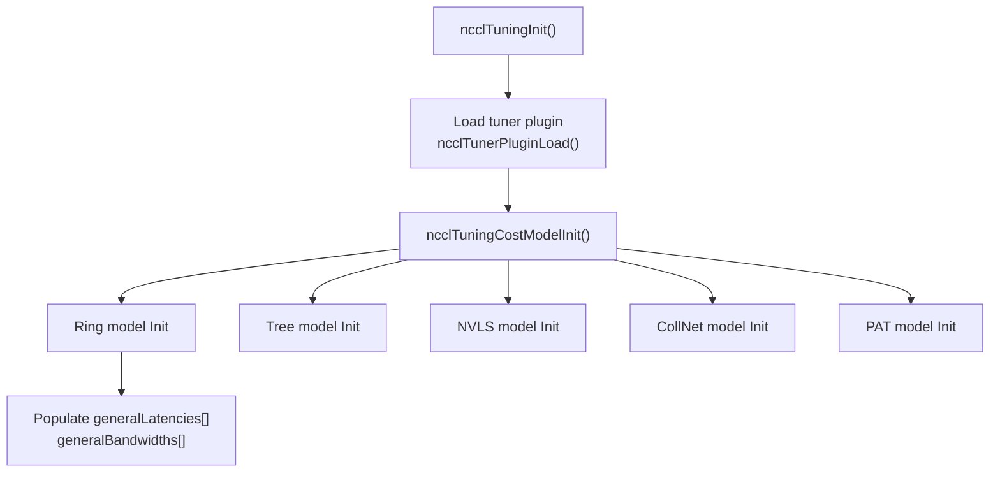
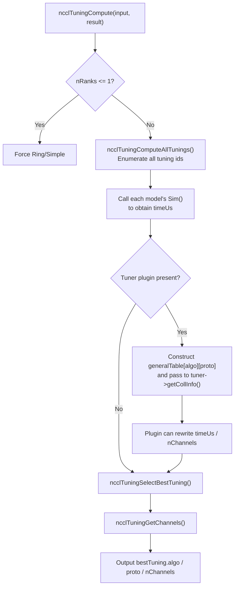

# NCCL Host Side: Building the Cost Table and Selecting Algorithms

> Based on the NCCL 2.31.2 source code in this repository.  
> Main files: `src/collectives.cc`, `src/enqueue/enqueue.cc`, `src/group.cc`, `src/tuning/*`, `src/include/tuning.h`.  
> This is the companion to the previous document, "NCCL Topology Construction and Algorithm Search": the previous document explains "how initialization turns a physical graph into ring/tree," while this one explains "how a runtime `ncclAllGather` selects algorithms and protocols."

## 0. First, the version history of `topoGetAlgoInfo` and `costTable`

In NCCL 2.18 and earlier, algorithm-selection logic was concentrated in `src/graph/tuning.cc`:

- During initialization, `ncclTopoTuneModel()` generated two tables, `bandwidths[algo][proto]` and `latencies[algo][proto]`, based on the topology bandwidth in `comm->graphs[]`.
- Each collective used `topoGetAlgoInfo()` to look up these tables and estimate `time = latency + nBytes/bandwidth`, selecting the minimum.

This mental model of a "two-dimensional cost table + table lookup to choose the minimum" is still valid today, but the implementation has been refactored:

- `topoGetAlgoInfo()` no longer exists; its replacement is `ncclGetAlgoInfo()` → `ncclTuningCompute()`.
- The static two-dimensional tables have become `generalLatencies[]` / `generalBandwidths[]` inside `ncclTuningContext`.
- At runtime, a `generalTable[algo][proto]` snapshot is still constructed and passed to the tuner plugin. In the plugin interface, it is called `collCostTable`.

So when people say "there is an important structure called costtable," they are correct, but in 2.31 it has changed form.

## 1. The actual call chain

The general direction is correct, but several function names need to be aligned with the current code:

```text
ncclAllGather()
  -> ncclAllGatherConfigImpl()          // Construct ncclInfo
  -> ncclEnqueueCheck()
       -> ncclGroupStartInternal()
       -> taskAppend()                  // First append the task to the planner
       -> ncclGroupEndInternal()
            -> groupLaunch()            // Choose legacy or enqueue rearch
                 -> ncclPrepareTasksAndCollPreconnect()
                      -> ncclPrepareTasks()
                           -> ncclGetAlgoInfo()
                                -> ncclTuningCompute()   // Successor to the old topoGetAlgoInfo
```

As a Mermaid diagram:

```mermaid
flowchart LR
  A["ncclAllGather()"] --> B["ncclAllGatherConfigImpl()<br/>Construct ncclInfo"]
  B --> C["ncclEnqueueCheck()"]
  C --> D["ncclGroupStartInternal()"]
  D --> E["taskAppend()<br/>Task added to planner.collSorter"]
  E --> F["ncclGroupEndInternal()"]
  F --> G["groupLaunch()"]
  G --> H["ncclPrepareTasksAndCollPreconnect()"]
  H --> I["ncclPrepareTasks()"]
  I --> J["ncclGetAlgoInfo()"]
  J --> K["ncclTuningCompute()<br/>Cost table + choose minimum"]
```



One important point: the `taskAppend` stage **does not perform algorithm selection**. It only turns the collective into an `ncclTaskColl` and puts it into `planner.collSorter`. The real selection is deferred until `ncclGroupEnd()`.

## 2. `ncclAllGather`: it only constructs an `ncclInfo`

The public API is thin; its core is filling in `ncclInfo` and passing it to enqueue:

```c
// src/collectives.cc
static inline ncclResult_t ncclAllGatherConfigImpl(...) {
  struct ncclInfo info = {ncclFuncAllGather, "AllGather",
                          sendbuff, recvbuff, sendcount, datatype,
                          ncclSum, 0, comm, stream,
                          ALLGATHER_CHUNKSTEPS, ALLGATHER_SLICESTEPS};
  NCCLCHECK(ncclParseCollConfig(config, &info.collConfig));
  return ncclEnqueueCheck(&info);
}
```

Here `ncclInfo` is only a "carrier of the user request"; it does not yet contain the algorithm / protocol decision result.

## 3. `taskAppend`: append the task first, without selecting an algorithm

`taskAppend` converts `ncclInfo` into a task and places it into `comm->planner`:

```c
// src/enqueue/enqueue.cc
static ncclResult_t taskAppend(struct ncclComm* comm, struct ncclInfo* info) {
  ncclFunc_t collAPI = info->coll;
  if (ncclParamEnqueueRearchEnable()) {
    NCCLCHECK(rawTaskAppend(comm, info));
  } else if (info->coll == ncclFuncSend || info->coll == ncclFuncRecv) {
    NCCLCHECK(p2pTaskAppend(...));
  } else if (/* PutSignal / Signal / WaitSignal */) {
    NCCLCHECK(rmaTaskAppend(comm, info));
  } else {
    // ...
    NCCLCHECK(collTaskAppend(comm, info, opDev));  // Collectives enter collSorter
  }
}
```

For a collective such as AllGather, the path eventually goes to `collTaskAppend`. Note that it already handles some preliminary decisions, such as degrading single-rank operations to memcpy, the CE path, and degrading AlltoAll/Gather/Scatter to send/recv. But the final ring/tree/NVLS selection still waits until group end.

## 4. `ncclGroupEndInternal` and `groupLaunch`

The tail of `ncclEnqueueCheck` calls `ncclGroupEndInternal()`, and the actual group execution starts here:

```c
// src/group.cc
static ncclResult_t groupLaunch(struct ncclAsyncJob* job_, ncclSimInfo_t* simInfo = NULL) {
  return ncclParamEnqueueRearchEnable()
           ? groupLaunchEnqueueRearch(job_, simInfo)
           : groupLaunchLegacy(job_, simInfo);
}
```

That is, there are currently two execution paths:

- `groupLaunchLegacy`: the traditional path described in the call chain above.
- `groupLaunchEnqueueRearch`: the new enqueue rearchitecture path.

In the legacy path, `ncclPrepareTasksAndCollPreconnect()` is called for each collective communicator, and internally it calls `ncclPrepareTasks()`.

## 5. `ncclPrepareTasks`: aggregate tasks and trigger algorithm selection

`ncclPrepareTasks` is the task-organization function executed once per group. It first takes tasks out of `collSorter`, buckets them by `(func, op, datatype)`, aggregates sizes within each bucket, and then calls `ncclGetAlgoInfo()` for each aggregated task:

```c
// src/enqueue/enqueue.cc
// Tasks from the sorter come out ordered size descending.
struct ncclTaskColl* task = ncclTaskCollSorterDequeueAll(&planner->collSorter);

for (int cursor = 0; cursor < fnOpTyCount; cursor++) {
  struct ncclTaskColl* aggBeg = tasksByFnOpTy[fnOpTyIndices[cursor]];
  int collNetSupport = 0;
  ncclGetCollNetSupport(comm, aggBeg, &collNetSupport);
  int nvlsSupport = ...;
  int nTasksPerChannel = divUp(comm->planner.nTasksColl, comm->nChannels);
  do {
    struct ncclTaskColl agg = *aggBeg;
    // We aggregate operations that are within 4X size of each other.
    while (aggEnd != nullptr && aggEnd->trafficBytes < 4 * aggBeg->trafficBytes &&
           !aggBeg->aggIsolate && !aggEnd->aggIsolate) {
      agg.count += aggEnd->count;
      agg.trafficBytes += aggEnd->trafficBytes;
      aggEnd = aggEnd->next;
    }

    NCCLCHECK(ncclGetAlgoInfo(comm, &agg, collNetSupport, nvlsSupport,
                              nTasksPerChannel, simInfo));
    agg.devFuncId = ncclDevFuncId(agg.func, agg.opDev.op, agg.datatype,
                                  agg.algorithm, agg.protocol);
    ...
  } while (...);
}
```

Several points in this code:

- Tasks are processed from largest to smallest size.
- Tasks whose sizes differ by less than 4x are aggregated, reducing kernel launch count.
- `collNetSupport` and `nvlsSupport` are "admission conditions" for algorithm selection.
- `ncclGetAlgoInfo` returns `algorithm` / `protocol`, and then `devFuncId` is computed, which identifies the device-side kernel.

## 6. `ncclGetAlgoInfo`: construct the input and call tuning

`ncclGetAlgoInfo` is now just an adapter over `ncclTuningCompute`:

```c
// src/enqueue/enqueue.cc
ncclResult_t ncclGetAlgoInfo(struct ncclComm* comm, struct ncclTaskColl* info,
                             int collNetSupport, int nvlsSupport,
                             int numPipeOps, ncclSimInfo_t* simInfo) {
  size_t elementSize = ncclTypeSize(info->datatype);
  size_t nBytes = elementSize *
                  ncclFuncMaxSendRecvCount(info->func, comm->nRanks, info->count);

  struct ncclTuningInput_t input;
  input.comm = comm;
  input.tuningMask = NCCL_TUNING_MASK_GENERAL_KERNELS;
  input.func = info->func;
  input.redOp = info->opHost;
  input.devRedOp = info->opDev.op;
  input.datatype = info->datatype;
  input.nBytes = nBytes;
  input.numPipeOps = numPipeOps;
  input.collNetSupport = collNetSupport;
  input.nvlsSupport = nvlsSupport;
  input.count = info->count;
  NCCLCHECK(ncclGetRegBuff(comm, info, &input.regBuff));

  struct ncclTuningResult_t bestTuning = NCCL_TUNING_RESULT_INIT;
  NCCLCHECK(ncclTuningCompute(&input, &bestTuning));

  info->algorithm = bestTuning.algo;
  info->protocol = bestTuning.proto;
  info->nWarps = bestTuning.nWarps;
  info->nMaxChannels = bestTuning.maxChannels == 0
                         ? info->nMaxChannels : bestTuning.maxChannels;
  return ncclSuccess;
}
```

It packages the collective context into `ncclTuningInput_t` and passes it to `ncclTuningCompute` for the actual simulation and selection.

## 7. Where the cost table actually lives

In 2.31, the core of the "cost table" is in `comm->tuningContext`:

```c
// src/include/tuning.h
struct ncclTuningContext_t {
  ncclTunerConstants_t tuningConstants;
  int forced[NCCL_NUM_FUNCTIONS];
  int enabled[NCCL_TUNING_COUNT][NCCL_NUM_FUNCTIONS];
  float generalLatencies[NCCL_NUM_FUNCTIONS]
                        [NCCL_NUM_ALGORITHMS]
                        [NCCL_NUM_PROTOCOLS];
  float generalBandwidths[NCCL_NUM_FUNCTIONS]
                         [NCCL_NUM_ALGORITHMS]
                         [NCCL_NUM_PROTOCOLS];
  ssize_t threadThresholds[NCCL_NUM_ALGORITHMS][NCCL_NUM_PROTOCOLS];
  int maxThreads[NCCL_NUM_ALGORITHMS][NCCL_NUM_PROTOCOLS];
};
```

These two tables are the "cost table":

- `generalLatencies[func][algo][proto]`: base latency of that algorithm/protocol for that function.
- `generalBandwidths[func][algo][proto]`: effective bandwidth of that algorithm/protocol.

Algorithm and protocol numbers are defined in `src/include/plugin/nccl_tuner.h`:

```c
#define NCCL_ALGO_TREE           0
#define NCCL_ALGO_RING           1
#define NCCL_ALGO_COLLNET_DIRECT 2
#define NCCL_ALGO_COLLNET_CHAIN  3
#define NCCL_ALGO_NVLS           4
#define NCCL_ALGO_NVLS_TREE      5
#define NCCL_ALGO_PAT            6

#define NCCL_PROTO_LL    0
#define NCCL_PROTO_LL128 1
#define NCCL_PROTO_SIMPLE 2
```

So the whole table is a three-dimensional structure of `function × algorithm × protocol`.

## 8. How the cost table is built: initialization phase

The cost table is not recalculated for every collective; it is built once when the communicator is initialized.



The model registry is in `src/tuning/cost_model.cc`:

```c
static struct ncclTuningModelEntry_t modelMap[] = {
  {ncclTuningTreeModelInit,    ncclTuningTreeModelSim,    nullptr, {0,0,0,0,1}}, // Tree/LL
  {ncclTuningTreeModelInit,    ncclTuningTreeModelSim,    nullptr, {0,0,0,0,1}}, // Tree/LL128
  {ncclTuningTreeModelInit,    ncclTuningTreeModelSim,    nullptr, {0,0,0,0,1}}, // Tree/Simple
  {ncclTuningRingModelInit,    ncclTuningRingModelSim,    nullptr, {1,1,1,1,1}}, // Ring/LL
  {ncclTuningRingModelInit,    ncclTuningRingModelSim,    nullptr, {1,1,1,1,1}}, // Ring/LL128
  {ncclTuningRingModelInit,    ncclTuningRingModelSim,    nullptr, {1,1,1,1,1}}, // Ring/Simple
  ...
};
```

The `enabled` array indicates for which functions a model is available. For example, Ring is available for almost all functions, Tree mainly serves AllReduce, and CollNet/NVLS support only the Simple protocol.

Taking Ring as an example, here is how bandwidth is computed:

```c
// src/tuning/ring.cc
int nSteps = ncclTuningGetNsteps(c, comm->nRanks);
float bw = (comm->nNodes == 1 || ...) ? comm->graphs[algo].bwIntra
                                       : comm->graphs[algo].bwInter;
float busBw = bw * comm->graphs[algo].nChannels;
if (proto == NCCL_PROTO_LL) {
  busBw = std::min(llMaxBw, busBw * .5);
}
if (proto == NCCL_PROTO_LL128) {
  busBw = std::min(busBw * (0.92), comm->graphs[algo].nChannels * perChMaxRingLL128Bw);
}

comm->tuningContext.generalLatencies[c][algo][proto] =
  comm->tuningContext.tuningConstants.baseLatencies[algo][proto];
comm->tuningContext.generalBandwidths[c][algo][proto] =
  busBw * comm->nRanks / nSteps;
```

Here you can see:

- Base bandwidth comes from `comm->graphs[algo].bwIntra / bwInter` discovered in the previous document.
- It is multiplied by the channel count to produce bus bandwidth `busBw`.
- LL / LL128 have their own upper-bound corrections.
- Latency comes from the `baseLatencies` and `hwLatencies` constant tables.

`ncclTuningGetNsteps` uses "steps" to convert bus bandwidth into the effective bandwidth of a single collective:

```c
// src/tuning/tuning_general.cc
int ncclTuningGetNsteps(int coll, int nRanks) {
  if (coll == ncclFuncAllReduce) return 2 * (nRanks - 1);
  if (coll == ncclFuncReduceScatter || coll == ncclFuncAllGather) return nRanks - 1;
  return nRanks;
}
```

## 9. How cost is computed: the linear model

All algorithm models eventually call the same time-estimation function:

```c
// src/tuning/tuning_general.cc
float ncclTuningGetTime(struct ncclTuningInput_t* const inputs,
                        int a, float* lat, float* bw) {
  int latCount = a == NCCL_ALGO_RING
                   ? inputs->numPipeOps
                   : DIVUP(inputs->numPipeOps, NCCL_MAX_DEV_WORK_BATCH_COLLS);

  float precision_ratio = 1.0;
  if (inputs->datatype == ncclFloat8e4m3 || inputs->datatype == ncclFloat8e5m2) {
    if (a == NCCL_ALGO_RING && inputs->comm->nRanks > 8) {
      precision_ratio = 1024.0;
    }
  }

  return (*lat * latCount + inputs->nBytes / (1000 * (*bw))) * precision_ratio;
}
```

That is:

```text
timeUs = (latency × latCount + nBytes / (1000 × bandwidth)) × precision_ratio
```

In terms of units, `latency` is in microseconds, `bandwidth` is in GB/s, and `nBytes` is in bytes. `nBytes / bandwidth` first produces nanoseconds, then dividing by 1000 converts to microseconds.

So NCCL's cost model is essentially a linear "latency term + bandwidth term" model, with some engineering corrections on top (for example, Ring Simple applies a plateau coefficient for large messages, and FP8 deep rings receive a precision penalty).

## 10. How the algorithm is selected: `ncclTuningCompute`

The runtime selection logic is in `src/tuning/tuning.cc`, roughly as follows:



The enumeration and selection core:

```c
// src/tuning/tuning.cc
ncclResult_t ncclTuningComputeAllTunings(input, tunings) {
  for (int i = 0; i < NCCL_TUNING_COUNT; i++) {
    struct ncclTuningResult_t tuning = NCCL_TUNING_RESULT_INIT;
    tuning.id = i;
    if (!(input->tuningMask & (1lu << i))) continue;  // Excluded by mask
    ncclTuningExpandId(i, &tuning.algo, &tuning.proto,
                       &tuning.symKernelId, &tuning.ceMethodId);
    ncclTuningComputeTuning(i, input, &tuning);
    if (tuning.valid) ncclTuningResultListPushFront(tunings, tuning);
  }
}

static ncclResult_t ncclTuningSelectBestTuning(tunings, bestTuning) {
  bestTuning->timeUs = FLT_MAX;
  while (node != nullptr) {
    if (tuning.timeUs < bestTuning->timeUs) *bestTuning = tuning;
    node = node->next;
  }
}
```

Key points:

- `tuningMask` determines which algorithms/protocols/symmetric kernels/CE methods may compete.
- Each candidate calls the corresponding model's `Sim()`, producing `timeUs`.
- When a tuner plugin exists, NCCL passes `generalTable[algo][proto]` (the `collCostTable` seen by the plugin) to the plugin, and the plugin can rewrite it.
- Finally, the candidate with the smallest `timeUs` is selected.

`ncclTuningExpandId` expands a one-dimensional tuning id back into algorithm/protocol/symmetric kernel/CE method:

```c
// src/tuning/tuning_general.cc
if (tuningId < NCCL_NUM_ALGORITHMS * NCCL_NUM_PROTOCOLS) {
  *algo = tuningId / NCCL_NUM_PROTOCOLS;
  *proto = tuningId % NCCL_NUM_PROTOCOLS;
} else if (tuningId < NCCL_TUNING_CE_METHOD_ID_OFFSET) {
  *symKernelId = tuningId - NCCL_NUM_ALGORITHMS * NCCL_NUM_PROTOCOLS;
} else {
  *ceMethodId = tuningId - NCCL_TUNING_CE_METHOD_ID_OFFSET;
}
```

So the current candidate space is no longer just `algo × proto`; it also includes symmetric kernels and CE methods.

## 11. After the algorithm is selected

After `ncclGetAlgoInfo` obtains `bestTuning`, it sets:

- `algorithm` / `protocol`.
- `nWarps` (the number of warps for each kernel).
- `nMaxChannels`.
- `devFuncId` (the corresponding device-side kernel function).

`ncclPrepareTasks` then buckets these tasks by scheduling constraints (collnet × nvls), and later proceeds to chunking, channel assignment, and kernel/proxy dispatch.

In other words, algorithm selection is only the first half of "scheduling":

```text
Select algo/proto -> Compute chunks -> Assign channels/CTAs -> Generate kernel plan -> Launch
```

## 12. Summary: from "look up the table and choose the minimum" to the "tuning framework"

When the two documents are read together, the NCCL host side consists of two phases:

1. Initialization phase: build the physical topology → search logical graphs → build the cost table from the bandwidth/latency in those graphs.
2. Runtime phase: append tasks → aggregate → simulate candidate algorithms using the cost table → choose the minimum cost → generate the execution plan.

The "cost table + algorithm selection" mentioned earlier is the core of the second phase, and its input is exactly `comm->graphs[]` from the first phase. This once again confirms the view that NCCL is essentially a resource-matching system, and the cost table is the core data structure it uses to measure "which resource combination is cheaper."

## Reference source code

- API entry points: `src/collectives.cc`
- Task append and enqueue: `src/enqueue/enqueue.cc` (`taskAppend`, `ncclEnqueueCheck`, `ncclPrepareTasks`, `ncclGetAlgoInfo`)
- Group execution: `src/group.cc` (`groupLaunch`, `ncclGroupEndInternal`, `ncclPrepareTasksAndCollPreconnect`)
- Tuning framework: `src/tuning/tuning.cc`, `src/tuning/cost_model.cc`, `src/tuning/tuning_general.cc`
- Algorithm cost models: `src/tuning/ring.cc`, `tree.cc`, `nvls.cc`, `collnet.cc`, `pat.cc`
- Data structures: `src/include/tuning.h`, `src/include/plugin/nccl_tuner.h`
