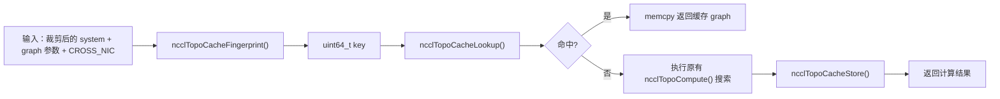
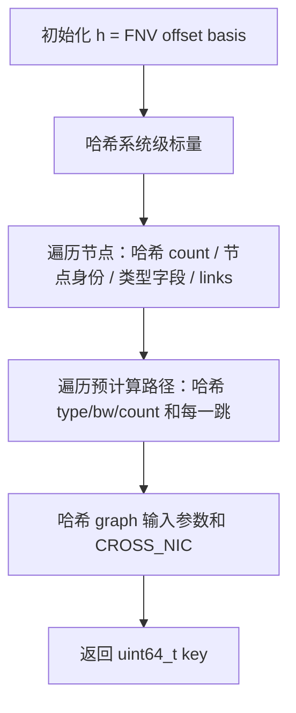
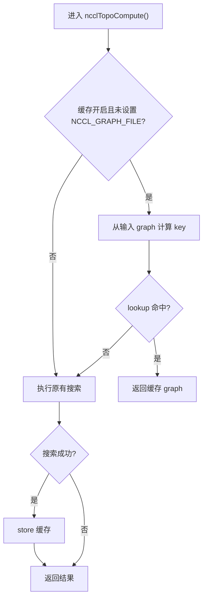

# NCCL 进程内拓扑搜索缓存设计文档

## 0. 文档说明

本文档记录一个**实验性的进程内拓扑搜索缓存**实现。

- 代码位置：[src/graph/search.cc](C:/Users/79811/Desktop/nccl/nccl-master/nccl-master/src/graph/search.cc)
- 状态：实验性原型，默认关闭，需通过 `NCCL_TOPO_CACHE_ENABLE=1` 开启。
- 定位：本地学习/研究性改动，不建议直接向上游提交。

---

## 1. 需求分析

### 1.1 背景

NCCL 初始化时，host 侧会为每个 communicator 计算逻辑拓扑：

```text
ncclTopoGetSystem()        // 建立物理拓扑 ncclTopoSystem
  -> ncclTopoComputePaths()   // 预计算节点间路径
  -> ncclTopoTrimSystem()     // 裁剪不可达设备
  -> ncclTopoCompute()        // 为 Ring/Tree/CollNet/NVLS 搜索逻辑拓扑
```

其中 `ncclTopoCompute()` 内部使用 DFS + 回溯（`ncclTopoSearchRec()` / `ncclTopoSearchRecGpu()` / `ncclTopoSearchRecNet()`）枚举候选图。虽然 NCCL 已经设置了搜索时间预算：

```c
#define NCCL_SEARCH_GLOBAL_TIMEOUT (1ULL << 19)
#define NCCL_SEARCH_TIMEOUT        (1 << 14)
#define NCCL_SEARCH_TIMEOUT_TREE   (1 << 14)
#define NCCL_SEARCH_TIMEOUT_SAMECHANNELS (1 << 8)
```

但物理拓扑复杂时，搜索仍然是一笔可避免的重复开销。

### 1.2 目标

当同一进程内多次创建具有相同“裁剪后拓扑”和相同搜索参数的 communicator 时：

1. 避免重复执行 `ncclTopoCompute()` 中的 DFS + 回溯搜索；
2. 直接复用上一次计算完成的 `ncclTopoGraph`。

### 1.3 功能需求

1. 以“裁剪后的 `ncclTopoSystem` + graph 输入参数 + 相关环境开关”作为缓存 key。
2. 命中缓存时直接返回上一次计算完成的 `ncclTopoGraph`。
3. 未命中时走原有搜索逻辑，并在成功后写入缓存。
4. 默认关闭，通过 `NCCL_TOPO_CACHE_ENABLE=1` 开启。
5. 多线程创建 communicator 时保证缓存访问线程安全。

### 1.4 非功能需求

- 不改变公开 API。
- 不改变通信结果，只影响初始化阶段的图计算路径。
- 不引入跨进程、跨线程之外的外部依赖。

### 1.5 非目标

- 不做跨进程缓存。
- 不做持久化到磁盘。
- 不改变搜索算法本身。
- 不承诺大幅初始化性能提升。

### 1.6 正确性约束

这是本设计最重要的约束：

> 缓存 key 必须是“搜索结果的完整决定因素”的内容指纹；宁可在 key 中多包含字段，导致缓存未命中（安全），也不能少包含字段，导致返回过期结果（错误）。

原因在于，`ncclTopoSystem` 并不等价于“机器物理拓扑”。它是经过以下处理后的 communicator 相关结构：

- `ncclTopoTrimSystem()` 会根据 P2P/SHM 可达性删掉不可达 GPU；
- `ncclTopoComputePaths()` 会根据 P2P/GDR/PXN 情况改写路径；
- 网络节点来自 net/gin/rma/collnet 插件导入。

因此同一台机器上的两个不同 communicator，其 `system` 内容可能不同。key 必须对“裁剪后的 system”本身做指纹，而不能只对“物理硬件”做指纹。

同时，搜索结果还依赖 graph 的输入参数和 `NCCL_CROSS_NIC` 等环境开关，这些也必须纳入 key。

---

## 2. 总体设计

缓存是 `search.cc` 内的进程级静态表：



关键设计决策：

- **进程内**：缓存不跨进程，避免机器/rank 身份和持久化一致性问题。
- **保守指纹**：对影响搜索结果的输入做内容哈希，安全优先。
- **可选开启**：默认关闭，不影响现有行为。
- **固定小表 + mutex**：4 个槽位，简单淘汰，串行化访问。

---

## 3. 数据结构

### 3.1 缓存开关

```c
NCCL_PARAM(TopoCacheEnable, "TOPO_CACHE_ENABLE", 0);
```

对应环境变量 `NCCL_TOPO_CACHE_ENABLE`，默认值为 0（关闭）。

### 3.2 缓存表大小

```c
#define NCCL_TOPO_CACHE_MAX_ENTRIES 4
```

取 4 是因为单个 `ncclTopoGraph` 很大：

```c
struct ncclTopoGraph {
  ...
  int intra[MAXCHANNELS * NCCL_TOPO_MAX_NODES];  // 64 * 640 * 4 字节
  int64_t inter[MAXCHANNELS * 2];                // 64 * 2 * 8 字节
};
```

一个 `ncclTopoGraph` 约 165 KB。4 个槽位足以覆盖一个 communicator 的 Ring / Tree / CollNet / NVLS 图，同时控制静态内存占用。

### 3.3 缓存条目

```c
// 一条缓存结果：key 标识 (system, graph 输入参数) 这一对输入，
// graph 是 ncclTopoCompute() 计算完成的逻辑拓扑。
struct ncclTopoCacheEntry {
  uint64_t key;
  struct ncclTopoGraph graph;
  int used;
};
```

### 3.4 全局缓存与锁

```c
// 缓存是进程内的，但会被本进程中的多个 communicator/线程共享，因此需要加锁。
static std::mutex ncclTopoCacheMutex;
static struct ncclTopoCacheEntry ncclTopoCache[NCCL_TOPO_CACHE_MAX_ENTRIES];
```

缓存是进程内的，但多个 communicator/线程可能并发初始化，因此用 `std::mutex` 保护。

---

## 4. 哈希与指纹设计

指纹采用 FNV-1a 64 位哈希。

### 4.1 基础哈希函数

```c
static uint64_t ncclTopoCacheHashBytes(uint64_t h, const void* data, size_t len);
static uint64_t ncclTopoCacheHashU32(uint64_t h, uint32_t v);
static uint64_t ncclTopoCacheHashU64(uint64_t h, uint64_t v);
static uint64_t ncclTopoCacheHashFloat(uint64_t h, float v);
```

说明：

- `HashBytes` 是 FNV-1a 核心。
- `HashU32` / `HashU64` 分别哈希 32 位、64 位整数。
- `HashFloat` 对 float 的原始位模式哈希。相同拓扑值来自同一代码路径，进程内值相同即位模式相同，因此可用于缓存指纹。

### 4.2 指纹覆盖内容

`ncclTopoCacheFingerprint()` 依次覆盖：

#### 4.2.1 系统级标量

```c
system->systemId
system->nHosts
system->inter
system->maxBw
system->totalBw
```

#### 4.2.2 节点身份、类型特有属性、直接链路

- 每类节点的 `count`；
- 每个节点的 `type`、`id`；
- GPU：`dev / rank / cudaCompCap / gdrSupport / mloPart / parent->id`；
- DEV：`device / dev / cudaCompCap / nGpus`；
- NET：`dev / vendor / device / pciId / asic / port / bw / latency / gdrSupport / collSupport / maxChannels / localGpu / railId / planeId`；
- CPU：`arch / vendor / model`；
- PCI：`device`；
- 每条 link：`type / bw / remNode->type / remNode->id`。

#### 4.2.3 预计算路径

对每个节点的每个目标类型，哈希：

```c
path->type
path->bw
path->count
```

以及路径中每一跳 link 的：

```c
link->type
link->bw
link->remNode->type
link->remNode->id
```

搜索会沿着这些路径前进并临时修改/恢复链路带宽，因此路径摘要和每一跳都纳入身份。

#### 4.2.4 graph 输入参数

```c
graph->id
graph->pattern
graph->minChannels
graph->maxChannels
graph->collNet
ncclParamCrossNic()
```

这些必须在 `ncclTopoCompute()` 原地覆盖它们之前采集，尤其 `graph->pattern` 可能在搜索过程中从 `BALANCED_TREE` 变成 `TREE`。

---

## 5. 函数流程

### 5.1 `ncclTopoCacheEnabled()`

```c
static bool ncclTopoCacheEnabled() {
  return ncclParamTopoCacheEnable() != 0;
}
```

返回缓存是否启用，对应环境变量 `NCCL_TOPO_CACHE_ENABLE`。

### 5.2 `ncclTopoCacheHashBytes()` 等哈希函数

```c
static uint64_t ncclTopoCacheHashBytes(uint64_t h, const void* data, size_t len) {
  const uint64_t fnvPrime = 1099511628211ULL;
  const unsigned char* bytes = (const unsigned char*)data;
  for (size_t i = 0; i < len; i++) {
    h ^= bytes[i];
    h *= fnvPrime;
  }
  return h;
}
```

流程：

1. 以 FNV offset basis 作为初始值；
2. 对输入字节逐个执行 `h ^= byte; h *= fnvPrime`；
3. 返回哈希值。

### 5.3 `ncclTopoCacheFingerprint()`

流程：



### 5.4 `ncclTopoCacheLookup()`

```c
static int ncclTopoCacheLookup(uint64_t key, struct ncclTopoGraph* graph) {
  std::lock_guard<std::mutex> lock(ncclTopoCacheMutex);
  for (int i = 0; i < NCCL_TOPO_CACHE_MAX_ENTRIES; i++) {
    if (ncclTopoCache[i].used && ncclTopoCache[i].key == key) {
      memcpy(graph, &ncclTopoCache[i].graph, sizeof(*graph));
      return 1;
    }
  }
  return 0;
}
```

流程：

1. 加锁；
2. 线性遍历 4 个槽位；
3. 找到相同 key 且已使用，则 `memcpy` 整个 `ncclTopoGraph` 到调用方，返回 1；
4. 未命中返回 0。

`ncclTopoGraph` 是自包含结构（没有指向 `system` 的指针），所以整体 `memcpy` 即可。

### 5.5 `ncclTopoCacheStore()`

```c
static void ncclTopoCacheStore(uint64_t key, struct ncclTopoGraph* graph) {
  std::lock_guard<std::mutex> lock(ncclTopoCacheMutex);
  int slot = 0;
  for (int i = 0; i < NCCL_TOPO_CACHE_MAX_ENTRIES; i++) {
    if (!ncclTopoCache[i].used) {
      slot = i;
      break;
    }
  }
  ncclTopoCache[slot].used = 1;
  ncclTopoCache[slot].key = key;
  memcpy(&ncclTopoCache[slot].graph, graph, sizeof(*graph));
}
```

流程：

1. 加锁；
2. 找第一个空槽；
3. 表满时复用 slot 0（简单淘汰）；
4. 写入 key 和完整 graph。

### 5.6 与 `ncclTopoCompute()` 的集成

入口处：

```c
// 缓存查找。指纹必须在 ncclTopoCompute() 开始覆盖字段之前，从“输入”graph 计算。
// 设置 NCCL_GRAPH_FILE 时搜索被完全绕过，因此这种情况也跳过缓存。
uint64_t topoCacheKey = 0;
bool topoCacheActive = ncclTopoCacheEnabled() && ncclGetEnv("NCCL_GRAPH_FILE") == NULL;
if (topoCacheActive) {
  topoCacheKey = ncclTopoCacheFingerprint(system, graph);
  if (ncclTopoCacheLookup(topoCacheKey, graph)) return ncclSuccess;
}
```

成功退出前：

```c
// 只缓存成功的搜索结果。
if (topoCacheActive) ncclTopoCacheStore(topoCacheKey, graph);
ret = ncclSuccess;
exit:
  free(tmpGraph);
  return ret;
```

完整流程：



---

## 6. 线程安全与淘汰策略

- 所有读写通过 `std::mutex` 串行化，避免并发破坏缓存条目。
- 淘汰策略为“第一个空槽，满则复用 slot 0”。因为同一进程内不同拓扑数量通常很少，简单策略已足够。
- 缓存不跨进程，因此不需要处理进程间同步或持久化一致性。

---

## 7. 已知限制与风险

1. **静态内存占用**：缓存表固定为 4 个 `ncclTopoGraph`，约 660 KB BSS，无论是否开启缓存都会保留。
2. **收益可能有限**：`ncclTopoSearchRec*` 已有硬时间预算，且初始化阶段更耗时的是 allgather、连接建立等。缓存只在“同进程内重复创建相同拓扑 communicator”时才有收益。
3. **不能直接上游提交**：上游对无收益、复杂、默认关闭的实验性缓存通常持谨慎态度，且静态大数组、固定淘汰策略、指纹维护成本都较高。
4. **哈希碰撞**：FNV-1a 64 位碰撞概率极低，但非零。作为原型可接受；若作为正式功能应改用更强指纹或完整序列化比较。
5. **未在本环境编译验证**：编写时无 CUDA 构建链，代码经过人工审查，但必须由开发者在目标环境编译、运行并验证。

---

## 8. 测试方案

### 8.1 构建

Make：

```bash
make -j src.build
```

或 CMake：

```bash
cmake -B build -DCMAKE_BUILD_TYPE=Release
cmake --build build -j
```

需要 CUDA 环境。

### 8.2 功能测试：缓存命中

开启缓存：

```bash
NCCL_TOPO_CACHE_ENABLE=1 NCCL_DEBUG=INFO NCCL_DEBUG_SUBSYS=GRAPH ./app
```

建议临时在 `ncclTopoCacheLookup()` 命中分支、`ncclTopoCacheStore()` 写入处加一行 `INFO(NCCL_GRAPH, ...)` 日志，观察：

```text
第一次创建 communicator：无 hit，发生 store
第二次创建相同 communicator：发生 hit，跳过搜索
```

### 8.3 正确性测试：缓存结果一致

方法一：开启 `NCCL_GRAPH_DUMP_FILE`，分别在有缓存和关闭缓存的情况下 dump ring/tree 图，比较 XML 是否一致。

方法二：运行 nccl-tests，验证 AllReduce / AllGather / ReduceScatter 等结果数值正确。

```bash
NCCL_TOPO_CACHE_ENABLE=1 ./all_reduce_perf -b 8 -e 256M -f 2 -g <ngpus>
```

### 8.4 负向测试：不同输入不应命中

验证以下输入变化会导致缓存未命中：

- 不同 `NCCL_CROSS_NIC`；
- 不同 communicator 的 GPU 子集；
- 不同的 graph 输入参数（pattern / minChannels / maxChannels）。

预期：不会复用旧缓存结果。

### 8.5 并发测试

从多个线程同时创建多个 communicator，开启缓存，配合 TSAN/ASAN 检查是否存在数据竞争或越界。

### 8.6 性能测试

测量同一进程内重复创建 N 次相同 communicator 的初始化耗时：

```text
关闭缓存：T_off
开启缓存：T_on
```

预期：

- `T_on <= T_off`；
- 若缓存命中，后续 communicator 的图搜索部分应明显下降；
- 但整体 init 耗时可能只下降有限比例，因为连接建立等步骤不受影响。

### 8.7 验收标准

- 开启缓存后结果正确，命中/未命中行为符合预期。
- 无数据竞争、无越界。
- 不改变通信正确性和公开 API。

---

## 9. 关键代码位置

| 内容 | 位置 |
| --- | --- |
| 拓扑缓存开关 | [search.cc](C:/Users/79811/Desktop/nccl/nccl-master/nccl-master/src/graph/search.cc:18) |
| 缓存表与条目结构 | [search.cc](C:/Users/79811/Desktop/nccl/nccl-master/nccl-master/src/graph/search.cc:1118) |
| 哈希与指纹函数 | [search.cc](C:/Users/79811/Desktop/nccl/nccl-master/nccl-master/src/graph/search.cc:1139) |
| lookup / store | [search.cc](C:/Users/79811/Desktop/nccl/nccl-master/nccl-master/src/graph/search.cc:1275) |
| `ncclTopoCompute()` 集成点 | [search.cc](C:/Users/79811/Desktop/nccl/nccl-master/nccl-master/src/graph/search.cc:1313) |
